# Catering Śląski — Pełna Specyfikacja Platformy Cateringowej

**Wersja:** 2.0
**Data:** 19 maja 2026
**Status:** Draft do akceptacji
**Stack:** Next.js 15 + Medusa.js 2.0 + PostgreSQL/PostGIS + Stripe + Vercel + Railway
**Autor:** Claude (autonomiczna sesja Cowork)
**Audytorium:** zespół developerski, product owner, operations

> **Uwaga merytoryczna**: Ten dokument zastępuje wcześniejszą propozycję `STRATEGIA.md` w warstwie stack technicznego. Strategia biznesowa (analiza konkurencji, design direction, AI features, GEO SEO) pozostaje aktualna. Tu skupiamy się na **architekturze cateringowej** — strefy logistyczne, okienka, transport, katalog z lead-time, produkcja, route planning.

---

## Spis treści

1. [Executive Summary](#1-executive-summary)
2. [Architektura techniczna](#2-architektura-techniczna)
3. [Model stref logistycznych](#3-model-stref-logistycznych)
4. [Okienka czasowe i capacity](#4-okienka-czasowe-i-capacity)
5. [Katalog produktów cateringowych](#5-katalog-produktów-cateringowych)
6. [Checkout cateringowy](#6-checkout-cateringowy)
7. [Panel admina (operations)](#7-panel-admina-operations)
8. [Integracje zewnętrzne](#8-integracje-zewnętrzne)
9. [Schema bazy danych](#9-schema-bazy-danych)
10. [Diagramy przepływów (Mermaid)](#10-diagramy-przepływów)
11. [Harmonogram dostarczania (5 sprintów)](#11-harmonogram-dostarczania)
12. [Risk register](#12-risk-register)

---

## 1. Executive Summary

### Co budujemy

Catering Śląski **v2** to platforma cateringowa **B2C + B2B** dla Górnego Śląska i całej Polski. Zastępuje obecny sklep na ec-instant-site (sztywny SaaS bez konfiguratora i AI).

Trzy filary techniczne:

1. **Medusa.js 2.0** jako commerce engine — produkty, koszyk, checkout, zamówienia, subskrypcje, customer accounts, admin panel.
2. **PostGIS** jako warstwa geometryczna — strefy dostawy jako polygony, point-in-polygon matching, route planning.
3. **Next.js 15** jako storefront — Server Components, AI SDK, Edge functions, top SEO.

### Czym ta architektura różni się od poprzedniej propozycji

Poprzednia wersja (`STRATEGIA.md`) używała **Sanity + Supabase** do commerce, co wymagało budowy cart/order/checkout/discounts od zera. Zmiana na **Medusa.js** daje to wszystko z pudełka. **Sanity zostaje, ale tylko dla content** (blog, story, GEO SEO articles), nie produktów.

### Co jest unikalne w cateringu vs zwykłym e-commerce

| Aspekt | Zwykły e-commerce | Catering Śląski |
|---|---|---|
| Dostępność produktu | "w magazynie" / "out of stock" | zależy od strefy klienta + dnia (capacity okienka) |
| Lead time | wysyłka 1-3 dni roboczych | per produkt + per strefa (0/1/2 dni), z cutoff godzinowym |
| Dostawa | uniwersalna stawka | per strefa, per metoda (własna flota / kurier) |
| Czas dostawy | "kiedy dotrze" | **konkretne okienko 2h** z capacity limit |
| Asortyment | jednakowy | **różny per strefa** (ciepłe dania tylko lokalnie) |
| Logistyka | etykieta i kurier | route planning, KDS, własna flota |
| Powtarzalność | subskrypcje SaaS-like | catering tygodniowy/miesięczny z rotacją menu |

Te różnice są **wbudowane w architekturę modułów Medusa** — nie hacki na zwykły e-commerce.

### Cele biznesowe (sukces = mierzalny)

| Cel | Metryka | Target Q4 2026 |
|---|---|---|
| Konwersja koszyk → checkout | % | >40% (vs typowo 25%) |
| Average Order Value | zł | >450 zł (vs obecne ~280 zł) |
| Mobile conversion | parity desktop | 100% (vs typowo 50%) |
| Strefa 3 (krajowa) — udział | % zamówień | 15% w 6 mies. |
| Subskrypcje B2B lunch | aktywne MRR | 50 firm |
| LCP (Core Web Vital) | sekundy | <1.5s |
| AI Generator → zamówienie | conversion | >25% |

---

## 2. Architektura techniczna

### High-level diagram

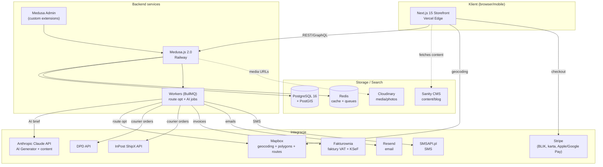

### Komponenty i odpowiedzialności

| Warstwa | Technologia | Odpowiedzialność |
|---|---|---|
| **Storefront** | Next.js 15 (App Router, RSC) | UI, geocoding adresu, AI demo, prezentacja katalogu, koszyk UI |
| **Commerce backend** | Medusa.js 2.0 (Node + TypeScript) | Produkty, koszyk, checkout, zamówienia, klienci, subskrypcje, custom modules (delivery_zones, time_slots) |
| **Admin** | Medusa Admin + custom React widgets | Operations (dashboard, KDS, route planning, zone editor) |
| **Workers** | BullMQ + Redis | Route optimization, AI jobs, courier API calls, email/SMS, fakturownia |
| **DB** | PostgreSQL 16 + PostGIS | Wszystkie dane transakcyjne i geometryczne |
| **Cache/Queue** | Redis 7 | Cache produktów, sessions, BullMQ queues |
| **Content** | Sanity Studio | Blog, story Śląsk, FAQ, GEO SEO content |
| **Media** | Cloudinary | Zdjęcia produktów (z transformacjami) |
| **Hosting** | Vercel (storefront), Railway (Medusa + Workers), Supabase/Neon (Postgres) | Production infrastructure |
| **Monitoring** | Sentry + BetterStack + Plausible/PostHog | Errors, uptime, analytics |

### Dlaczego Medusa.js 2.0 (a nie 1.x)

Medusa 2.0 (released koniec 2024) wprowadziło:
- **Modular architecture** — każdy moduł (cart, order, product) jest niezależny, łatwo wymienialny
- **Workflows** — composable business logic z transakcjami i compensation steps (jak SAGA)
- **Custom Modules first-class** — nasze `delivery_zones`, `time_slots`, `subscriptions` to natywne moduły
- **TypeScript end-to-end** — typesafe Admin API + Storefront API
- **Subscribers** — event-driven side effects (order.placed → invoice → email → SMS)

Medusa 1.x był OK, ale 2.x ma znacznie czystszą extensibility — co dla cateringu z custom logic jest krytyczne.

### Dlaczego Railway dla Medusa backend

Medusa wymaga always-on Node.js (nie serverless friendly). Railway daje:
- Zero-config deploy z GitHub
- Postgres + Redis dodaj-jednym-kliknięciem
- Cron jobs built-in (dla daily tasks)
- ~$5-20/mies dla startu, skaluje się

**Alternatywy**: Render (podobnie), Fly.io (geo-distributed), własny VPS (najwięcej pracy).

---

## 3. Model stref logistycznych

### 3 strefy — definicja biznesowa

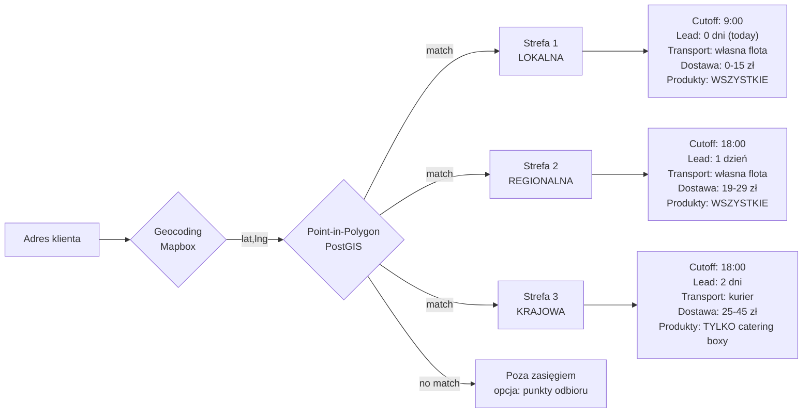

### Konfigurowalność

Trzy strefy to **default**, ale system jest n-stref. Admin może:
- Dodać Strefę 4 (np. premium 1-godzinna dostawa w centrum Katowic)
- Modyfikować polygony (przesunąć granicę między strefami)
- Zmienić cutoff godzinowy per strefa
- Wstrzymać strefę (urlop, brak kurierów, awaria)

### Mapowanie adres → strefa

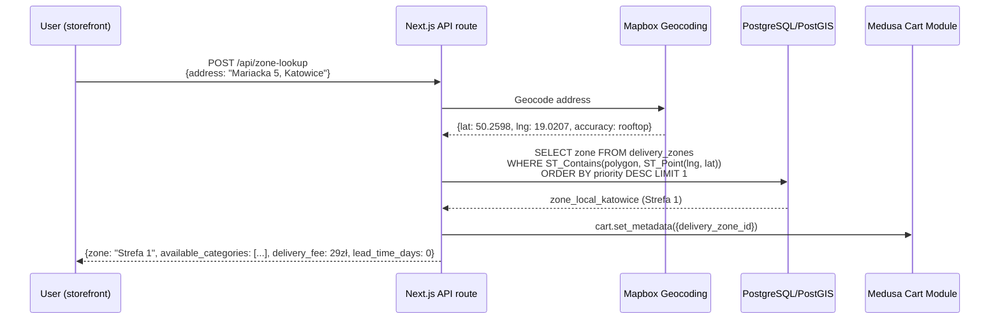

### Punkty odbioru (poza strefami)

Dla adresów poza wszystkimi polygonami:
- Opcja "odbiór osobisty" w Dąbrowie Górniczej (HQ)
- Opcja Paczkomat InPost (dla boxów catering — przechowuje 24h w chłodni paczkomat dedicated)
- Komunikat: "Twój adres jest poza naszymi strefami. Możesz odebrać osobiście lub w Paczkomacie."

### Priorytetyzacja polygonów (overlapping)

Jeśli adres trafia w więcej niż jeden polygon (np. Strefa 1 zawiera się w Strefie 2):
- `priority` field per zone
- Default order: LOCAL (3) > REGIONAL (2) > NATIONAL (1)
- Klient zawsze dostaje **najlepszą dostępną** strefę

### Dynamiczne wyłączanie

Strefa może być `is_active = false` (np. zamknięta z powodu awarii floty). Klient z adresem w tej strefie:
- Pokazujemy info "Dostawa do Twojej okolicy tymczasowo niedostępna"
- Sugerujemy: odbiór osobisty, paczkomat, alert email kiedy wróci

---

## 4. Okienka czasowe i capacity

### Model time slot

Każda strefa ma **template** okienek czasowych (np. dla Strefy 1):
- 10:00–12:00 (capacity 25)
- 12:00–14:00 (capacity 30)
- 14:00–16:00 (capacity 25)
- 16:00–18:00 (capacity 20)

Dla Strefy 3 (kurier): tylko 1 okienko "dzień dostawy" bez konkretnej godziny.

### Generowanie slotów

Cron job (nightly):
- Dla każdej aktywnej strefy
- Dla każdej daty w oknie +30 dni
- Stwórz time slots z template
- Skip dla dat wyłączonych (święta, urlop)

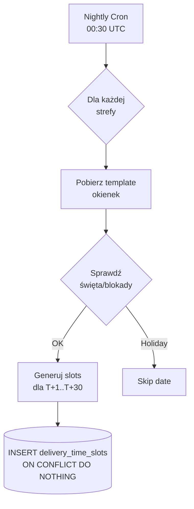

### Capacity locking podczas checkout

Krytyczne: **dwóch klientów nie może zarezerwować ostatniego miejsca w slocie**. Implementacja:

1. Klient wybiera slot → tworzy się **reservation** (TTL 15 min) zwiększające `booked_count`
2. Jeśli klient nie zapłaci w 15 min → reservation expires, capacity zwraca się
3. Przy `placeOrder` workflow → reservation finalize (status: confirmed)

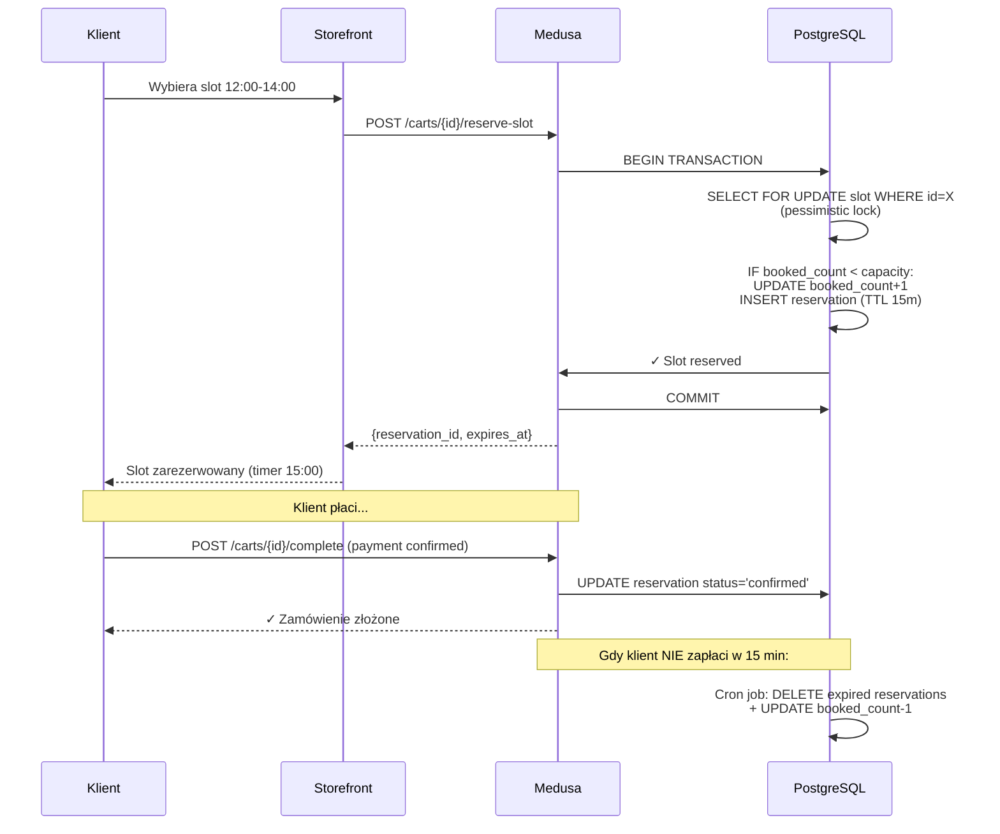

### Wyświetlanie dostępności

Storefront pyta API o sloty dla wybranej daty:

```typescript
// GET /api/time-slots?zone_id=X&date=2026-05-20
// Response:
{
  date: "2026-05-20",
  slots: [
    { id: "slot_1", from: "10:00", to: "12:00", capacity: 25, booked: 18, available: 7, status: "open" },
    { id: "slot_2", from: "12:00", to: "14:00", capacity: 30, booked: 30, available: 0, status: "full" },
    { id: "slot_3", from: "14:00", to: "16:00", capacity: 25, booked: 5, available: 20, status: "open" },
    { id: "slot_4", from: "16:00", to: "18:00", capacity: 20, booked: 12, available: 8, status: "open" }
  ]
}
```

UI: pełne sloty disabled z labelką "Wszystkie zajęte", inne klikalne.

### Admin: ręczne blokowanie

Admin może w dowolnym slocie:
- Zmniejszyć capacity (np. z 30 do 15 — mniej kierowców)
- Zablokować całkowicie (`status: blocked`)
- Zmienić godziny (np. 10:00–12:00 → 11:00–13:00)
- Zarezerwować dla VIP klienta (override capacity)

---

## 5. Katalog produktów cateringowych

### Klasyfikacja produktów

Catering Śląski ma 6 typów produktów, każdy z własnymi regułami:

| Typ | Przykład | Lead time | Strefy | Packaging |
|---|---|---|---|---|
| **hot_meals** | Rolada śląska, kluski, rosół | 0 dni | 1, 2 | Termiczne pojemniki, max 2h transportu |
| **catering_boxes** | BOX koktajlowy, finger food | 1 dzień | 1, 2, 3 | Drewniane pudełka, room temp |
| **diet_meals** | Box dietetyczny 5/7-dniowy | 1-2 dni | 1, 2, 3 | Pojemniki dietetyczne |
| **bundles** | Komunia BOX = rosół + rolada + tort | 1-2 dni | 1, 2 | Mix packaging |
| **event_special** | Tort komunijny, ciasta okolicznościowe | 3 dni | 1, 2 | Special (chłodnia) |
| **subscriptions** | Lunch firmowy tygodniowy | rotacja | 1, 2 | Standard |

### Custom metadata na Medusa Product

W Medusa 2.0 produkty mają `metadata` (JSON). Plus własna tabela `product_catering_attributes`:

```typescript
// Medusa Product extension
type CateringProduct = MedusaProduct & {
  catering_attributes: {
    product_category: 'hot_meals' | 'catering_boxes' | 'diet_meals' | 'bundles' | 'event_special' | 'subscription'
    production_lead_time_days: number  // 0 = same day, 1 = next, 3 = special
    cutoff_override_hour: number | null  // jeśli ten produkt ma inny cutoff
    packaging_type: 'thermal' | 'wooden_box' | 'diet_container' | 'cake_box' | 'mixed'
    shelf_life_hours: number  // dla produktów świeżych
    temperature_constraint: 'hot' | 'cold' | 'room_temp' | 'frozen'
    transport_max_hours: number  // limit czasu transportu (krytyczne dla strefy 3)
    portions_default: number
    portions_min: number
    portions_max: number
    diet_tags: ('vege' | 'vegan' | 'keto' | 'gluten_free' | 'lactose_free' | 'spicy')[]
    allergens: ('eggs' | 'milk' | 'gluten' | 'nuts' | 'fish' | 'soy')[]
    can_be_subscribed: boolean
    production_complexity: 1 | 2 | 3  // 1=prosty, 3=kucharz specjalista
  }
  zone_availability: Array<{
    delivery_zone_id: string
    is_available: boolean
    custom_lead_time_days: number | null  // override domyślnego z zone
    price_override_cents: number | null  // np. drożej w strefie 3 (transport)
  }>
}
```

### Product → Zone availability matrix

Tabela `product_zone_availability` (one-to-many):
- Produkt może być dostępny w wybranych strefach
- Domyślnie: hot_meals → tylko strefy 1, 2 (transport_max_hours = 2)
- catering_boxes → wszystkie strefy
- Admin może override

```sql
-- przykład: rolada śląska tylko lokalnie
INSERT INTO product_zone_availability (product_id, delivery_zone_id, is_available)
VALUES
  ('prod_rolada', 'zone_local', true),
  ('prod_rolada', 'zone_regional', true),
  ('prod_rolada', 'zone_national', false);

-- BOX koktajlowy wszędzie, ale w strefie 3 droższy (transport)
INSERT INTO product_zone_availability (product_id, delivery_zone_id, is_available, price_override_cents)
VALUES
  ('prod_box_koktajl', 'zone_local', true, NULL),
  ('prod_box_koktajl', 'zone_regional', true, NULL),
  ('prod_box_koktajl', 'zone_national', true, 38000); -- 380 zł zamiast 340 zł
```

### Lead time effective

Dla danego produktu w danej strefie efektywny lead time to:

```typescript
function getEffectiveLeadTime(product, zone): number {
  const productLT = product.catering_attributes.production_lead_time_days
  const zoneLT = zone.lead_time_days
  const overrideLT = product.zone_availability.find(z => z.delivery_zone_id === zone.id)?.custom_lead_time_days

  return overrideLT ?? Math.max(productLT, zoneLT)
}
```

**Przykład**: BOX koktajlowy (production_lead_time_days=1) + Strefa 3 (lead_time_days=2) = effective 2 dni.

Tort komunijny (production_lead_time_days=3) + Strefa 1 (lead_time_days=0) = effective 3 dni.

Storefront kalkuluje **najwcześniejszą dostępną datę** dla każdego produktu w koszyku → najpóźniejszy LT z koszyka wyznacza minimum.

### Bundle products

Bundle = produkt który składa się z wielu sub-produktów:
- "Komunia BOX rodzinny" = 1× rosół + 1× rolada (4 porcje) + 1× tort + 1× sałatki
- Medusa nie ma natywnie bundles (jest natomiast "Product Set" w 2.x preview)
- Implementacja: custom module `bundle_products` mapujący bundle → child products
- Inventory tracked per child product (nie per bundle)
- Lead time bundle = max(child lead times)

### Subskrypcje

Subskrypcja to **template**:
- "Lunch firmowy 5×/tydzień dla 10 osób"
- Customer wybiera plan + dzień startu + zone + slot
- Stripe Subscription tworzy się + Medusa Subscription module tworzy rekurencyjne orders
- Co tydzień (np. piątek 18:00) → cron tworzy order z subscription template → płatność Stripe → produkcja w poniedziałek → dostawa
- Klient może **paused** (urlop), **modify** (zmiana adresu/menu), **cancel**

---

## 6. Checkout cateringowy

### Pełny flow (Mermaid)

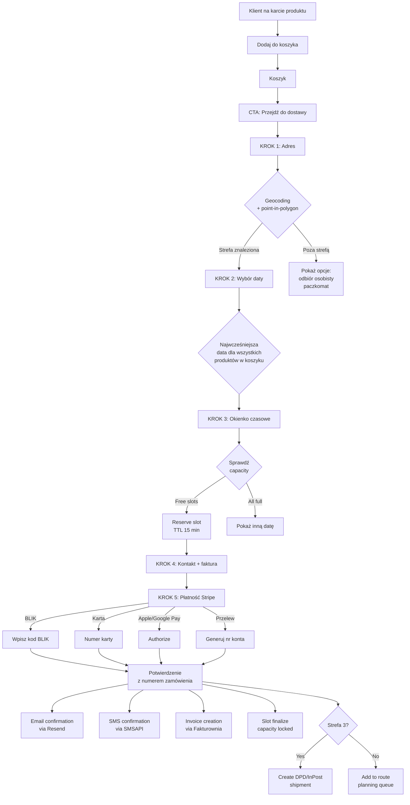

### UX checkout — wytyczne

**One-page checkout** z 5 sekcjami (zwija/rozwija):

1. **Adres dostawy + strefa**
   - Autouzupełnianie przez Mapbox Search Box
   - Po wybraniu adresu: mapa z markerem + polygon strefy podświetlony
   - Komunikat: "Dostarczymy do Twojej strefy: Lokalna (Strefa 1)"
   - Edge case: adres niejednoznaczny → klient potwierdza pin

2. **Data dostawy**
   - Kalendarz z disabled dates < effective lead time
   - Highlight najbliższej dostępnej
   - Info "Najwcześniej: jutro (środa 20 maja)" — explicite

3. **Okienko czasowe**
   - Lista 4 okienek z `available` count
   - Pełne okienka: szare + tooltip "Wszystkie miejsca zajęte"
   - Jedno okienko zaznaczone domyślnie (najbliższe wolne)
   - Timer 15 min od momentu rezerwacji (pokazany)

4. **Kontakt + faktura VAT** (jeśli zaznaczone)
   - Email, telefon (wymagane do SMS)
   - Opcja "Potrzebuję faktury VAT" → NIP + firma + adres
   - Domyślnie unchecked (klient B2C nie chce faktury w 80% wypadków)

5. **Płatność**
   - 4 metody: **BLIK** (PL #1), karta, Apple Pay, Google Pay
   - Stripe Checkout Embed lub Stripe Elements (Custom UI)
   - Trust badges: Stripe + SSL + 14-dniowy zwrot

### Mobile-first

Wszystko one-column na mobile. Każda sekcja sticky na top podczas wypełniania. Order summary jako collapsible drawer (default: zwinięte, expand z badge "919 zł").

### Polskie wymagania

- **VAT 23%** liczone automatycznie (w cenie brutto, ale wykazane w fakturze)
- **BLIK** jako default method (60%+ rynku PL e-commerce)
- **Faktura VAT** z NIP-em, KSeF-ready (po 2026 obligatoryjne w PL)
- **Polityka zwrotów 14 dni** — UE wymaga, ale dla żywności exception: catering boxes nie podlegają zwrotowi (klient akceptuje przy checkout)
- **RODO** consent — newsletter opt-in, processed lawfully
- **Akceptacja regulaminu** + linki do regulaminu/polityki prywatności

---

## 7. Panel admina (operations)

Medusa ma built-in Admin UI. My rozszerzamy go o catering-specific widgets.

### Dashboard główny

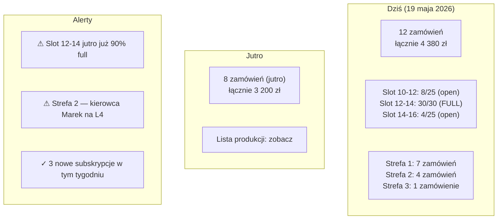

### KDS — Kitchen Display System

Custom Medusa Admin route: `/admin/kds`

Lista do produkcji na dziś + jutro, grupowana per produkt:
- "BOX koktajlowy II × 8 sztuk" (8 zamówień)
- "Rolada śląska 4 porcje × 3 sztuki" (3 zamówienia)
- "Tort komunijny × 1" (1 zamówienie, deadline 17:00 jutro)

Kucharz oznacza `started` → `done` → `packed`. Dane lecą w realtime do route plannera.

### Route Planner

Custom Medusa Admin route: `/admin/routes`

- Mapa Mapbox z punktami dostawy na dziś
- Filtracja per strefa, per kierowca
- Algorytm: **Mapbox Optimization API v2** (VRP — Vehicle Routing Problem)
  - Input: depot (HQ Dąbrowa) + n stops + time windows (slots klientów) + driver count
  - Output: optimal sequence + ETA dla każdego stopu
- Drag & drop manualnej zmiany kolejności
- Print/export routy dla kierowcy (PDF z mapą + adresami + telefonami)

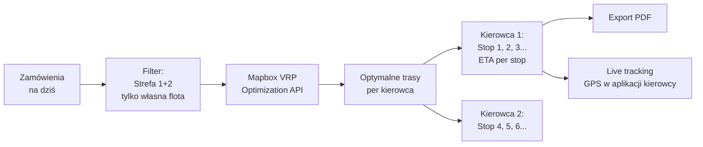

### Zone Editor

Custom Admin route: `/admin/delivery-zones`

- Mapa Mapbox z aktualnymi polygonami stref
- Toolbar: dodaj polygon (rysuj punkty), edytuj, usuń
- Sidebar: lista stref z konfiguracją (cutoff, lead, fee, etc.)
- Walidacja: polygony nie mogą "luki" (gap) między ważnymi obszarami
- Test: wpisz adres → pokaż w której strefie jest

### Time Slot Manager

Custom Admin route: `/admin/time-slots`

Kalendarz miesięczny + dzienny widok z slotami. Admin może:
- Zwiększyć/zmniejszyć capacity per slot
- Zablokować slot/dzień (urlop, święto)
- Override godzin (np. w święta dłuższe okienka)
- Zobaczyć obłożenie w czasie (heatmapa)

### Subscription Manager

Custom Admin route: `/admin/subscriptions`

- Lista aktywnych subskrypcji (filtruj per plan, customer, status)
- Detail: harmonogram dostaw, customer can pause/cancel z admin
- Alerty: subskrypcja nie powiodła się (payment failed) — manual intervention
- Próba ponownej płatności (retry rules)

### Reports

Custom Admin route: `/admin/reports`

- Revenue per strefa (dzienna, tygodniowa, miesięczna)
- AOV per produkt category
- Top 10 produktów (zamówienia + przychód)
- Conversion funnel (visits → cart → checkout → paid)
- NPS / opinie po dostawie
- Eksport CSV/Excel dla księgowości

---

## 8. Integracje zewnętrzne

### 8.1 Stripe — płatności

**Plugin**: `@medusajs/payment-stripe`

Metody:
- **BLIK** — przez Stripe Polski (settings: enable BLIK in Stripe Dashboard PL account)
- **Card** — Visa, Mastercard 3DS
- **Apple Pay** / **Google Pay** — native
- **Przelewy24** (alternatywa do BLIK) — przez Stripe lub direct (P24 API)

**Subskrypcje**: Stripe Subscriptions (recurring, automatic retries, dunning)

**Faktury proforma** dla B2B (terms 14/30 dni): Stripe Invoices (zamiast Checkout) → klient dostaje link do zapłaty z opcją przelewu

### 8.2 Mapbox

Trzy use cases:

1. **Geocoding API** — adres → lat/lng (input checkout)
   - Mapbox Search Box JS (autocomplete) w storefront
   - Tier: $5/1000 requests (start free 100k/mies)

2. **Static Maps** — polygony stref na storefront ("zobacz zasięg")
   - Lub interaktywna Mapbox GL JS

3. **Optimization API v2** — VRP route planning w admin
   - $2 per problem solved
   - ~30 problems/dzień = ~$2/dzień = $60/mies

**Alternatywa**: Google Maps (droższe, ale bardziej znane), HERE Maps (B2B-friendly).

### 8.3 Kurierzy

**DPD API** (Strefa 3):
- REST API (DPD Predict v2)
- Tworzenie shipmentu → numer listu → label PDF
- Tracking webhook (status updates)
- Pickup z HQ (codziennie do 14:00)
- Custom Medusa Fulfillment Provider: `medusa-fulfillment-dpd`

**InPost ShipX API** (Paczkomaty + kurier):
- Paczkomat-to-Paczkomat: klient odbiera w wybranym Paczkomat (24h chłodnia w paczkomatach z chłodzeniem? — sprawdzić)
- ShipX REST API
- Custom Medusa Fulfillment Provider: `medusa-fulfillment-inpost`

**Poczta Polska** (opcjonalna):
- Pocztex (rezerwa dla DPD/InPost)

**Decyzja**: na start tylko **DPD** dla Strefy 3. InPost jako opcja w fazie 4.

### 8.4 Fakturownia — faktury VAT

REST API, polski standard, KSeF integration (po 2026 obowiązkowy).

Subscriber pattern w Medusa:

```typescript
// medusa/src/subscribers/order-placed-invoice.ts
export default async function ({ event, container }: SubscriberArgs<{ id: string }>) {
  const orderService = container.resolve("orderService")
  const fakturowniaService = container.resolve("fakturowniaService")

  const order = await orderService.retrieve(event.data.id, { relations: ["items", "customer", "billing_address"] })

  if (order.metadata.requires_invoice) {
    const invoice = await fakturowniaService.createInvoice({
      kind: 'vat',
      number: null, // auto
      sell_date: new Date(),
      issue_date: new Date(),
      payment_to: addDays(new Date(), 14),
      seller: SELLER_DATA,
      buyer: {
        name: order.billing_address.company || `${order.billing_address.first_name} ${order.billing_address.last_name}`,
        tax_no: order.metadata.nip,
        post_code: order.billing_address.postal_code,
        city: order.billing_address.city,
        street: order.billing_address.address_1,
        email: order.customer.email
      },
      positions: order.items.map(it => ({
        name: it.title,
        quantity: it.quantity,
        total_price_gross: it.unit_price * it.quantity / 100,
        vat: 8 // żywność PL = 8% VAT
      }))
    })

    await orderService.update(order.id, { metadata: { ...order.metadata, fakturownia_invoice_id: invoice.id } })
  }
}

export const config: SubscriberConfig = { event: "order.placed", context: { subscriberId: "order-placed-invoice" } }
```

**KSeF (Krajowy System e-Faktur)**: Fakturownia wspiera natywnie od 2025, automatyczne wysyłanie do KSeF jeśli włączone.

### 8.5 Resend — email

Plugin: `@medusajs/notification-resend` (custom build)

Template events:
- `order.placed` → potwierdzenie zamówienia (React Email template z brand)
- `order.shipped` → "w drodze" (z tracking link)
- `order.delivered` → "smacznego!" + prośba o opinię
- `subscription.renewed` → "kolejna dostawa jutro"
- `cart.abandoned` (po 1h) → "Twój koszyk czeka" (recovery)
- `password.reset` → reset link

React Email pozwala na pisanie templates w JSX z hot reload.

### 8.6 SMSAPI.pl — SMS

Polski provider SMS (lepszy niż Twilio dla polskich numerów).

Events:
- Potwierdzenie zamówienia (krótki SMS z numerem zamówienia + linkiem do tracking)
- Powiadomienie o dostawie (kierowca ruszył, ETA 30 min)
- Subscription reminder (jutro dostawa Twojej subskrypcji)

Custom Medusa Notification Provider: `medusa-notification-smsapi`

### 8.7 Anthropic Claude API — AI

Flagowa: AI Generator menu w konfiguratorze B2B.

```typescript
// medusa/src/api/admin/ai/generate-menu/route.ts
export async function POST(req, res) {
  const { brief } = req.body  // "100 osób, urodziny 40-stka, 80 zł/os, 30% vege"
  const productCatalog = await getCateringProductsForAI() // skrócony katalog dla context

  const response = await anthropic.messages.create({
    model: "claude-sonnet-4-6",
    max_tokens: 2000,
    system: CATERING_AI_SYSTEM_PROMPT,
    messages: [
      { role: "user", content: `Katalog produktów (200 pozycji): ${JSON.stringify(productCatalog)}\n\nBrief klienta: ${brief}\n\nZaproponuj menu jako JSON.` }
    ]
  })

  const proposal = parseAIResponse(response.content[0].text)
  // proposal = { items: [{product_id, qty}], reasoning, total_cents, balance }

  return res.json({ proposal })
}
```

System prompt powinien zawierać:
- Zasady balansu menu (mięso/vege/słodkie ratios per event type)
- Reguły porcji per osoba (8-10 finger food / osobę, 1 BOX dla 10 os, etc.)
- Constraints budget
- Sezonowość
- Brand voice "Catering Śląski" (premium domowy)

**Inne AI use cases**:
- Auto-opisy produktów (1× run dla 200 SKU, sezonowe refreshe)
- Blog post drafts (z research)
- Customer support chat (Intercom Fin AI lub własny)

### 8.8 Sanity — content

Tylko **content/editorial**, nie commerce:
- Blog (artykuły GEO SEO: "Ile finger foodów na osobę?")
- O nas / Historia
- Realizacje (galeria z case studies)
- FAQ (długa, zoptymalizowana pod AI search)
- Strony promocyjne (np. "Komunia 2026")

Storefront fetchuje z Sanity przez GROQ queries (RSC).

---

## 9. Schema bazy danych

### Diagram ERD (high-level)

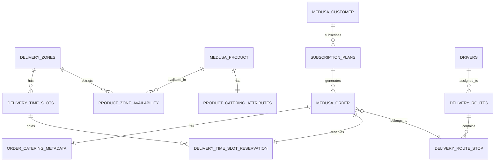

### Custom tables (poza Medusa core)

```sql
-- Wymagane: CREATE EXTENSION IF NOT EXISTS postgis;

-- ============================================
-- 1. DELIVERY_ZONES
-- ============================================
CREATE TYPE zone_type_enum AS ENUM ('local', 'regional', 'national');
CREATE TYPE delivery_method_enum AS ENUM ('own_fleet', 'courier_dpd', 'courier_inpost', 'pickup_only');

CREATE TABLE delivery_zones (
  id              text PRIMARY KEY DEFAULT 'dz_' || gen_random_uuid()::text,
  name            varchar(120) NOT NULL,
  slug            varchar(120) UNIQUE NOT NULL,
  zone_type       zone_type_enum NOT NULL,
  delivery_method delivery_method_enum NOT NULL,

  -- Geometry (PostGIS) — multipolygon żeby wspierać "wyspy"
  polygon         geometry(MultiPolygon, 4326) NOT NULL,

  -- Pricing
  base_delivery_fee_cents int NOT NULL DEFAULT 0,
  free_delivery_threshold_cents int NULL,  -- gratis powyżej

  -- Operations
  min_order_cents int NOT NULL DEFAULT 0,
  lead_time_days  int NOT NULL DEFAULT 0,
  cutoff_hour     int NOT NULL DEFAULT 18,  -- 0-23
  cutoff_minute   int NOT NULL DEFAULT 0,

  -- Allowed product categories (filtruje katalog)
  allowed_product_categories text[] NOT NULL DEFAULT ARRAY['catering_boxes'],

  -- Transport constraints (np. max 2h dla strefy 3 chłodzonych)
  max_transport_hours int NULL,

  -- Priority dla overlapping polygons
  priority        int NOT NULL DEFAULT 100,

  is_active       boolean NOT NULL DEFAULT true,
  display_color   varchar(7) DEFAULT '#C9A961', -- HEX dla mapy

  created_at      timestamptz NOT NULL DEFAULT now(),
  updated_at      timestamptz NOT NULL DEFAULT now(),
  deleted_at      timestamptz NULL
);

CREATE INDEX idx_delivery_zones_polygon ON delivery_zones USING GIST (polygon);
CREATE INDEX idx_delivery_zones_active ON delivery_zones (is_active) WHERE deleted_at IS NULL;

-- ============================================
-- 2. DELIVERY_TIME_SLOTS
-- ============================================
CREATE TYPE slot_status_enum AS ENUM ('open', 'full', 'blocked', 'closed');

CREATE TABLE delivery_time_slots (
  id                text PRIMARY KEY DEFAULT 'ts_' || gen_random_uuid()::text,
  delivery_zone_id  text NOT NULL REFERENCES delivery_zones(id) ON DELETE CASCADE,

  slot_date         date NOT NULL,
  time_from         time NOT NULL,
  time_to           time NOT NULL,

  capacity          int NOT NULL,
  booked_count      int NOT NULL DEFAULT 0,

  status            slot_status_enum NOT NULL DEFAULT 'open',
  admin_note        text NULL,

  created_at        timestamptz NOT NULL DEFAULT now(),
  updated_at        timestamptz NOT NULL DEFAULT now(),

  CONSTRAINT slot_capacity_positive CHECK (capacity >= 0),
  CONSTRAINT slot_booked_lte_capacity CHECK (booked_count <= capacity),
  CONSTRAINT slot_time_order CHECK (time_to > time_from),
  CONSTRAINT slot_unique UNIQUE (delivery_zone_id, slot_date, time_from)
);

CREATE INDEX idx_slots_zone_date ON delivery_time_slots (delivery_zone_id, slot_date);
CREATE INDEX idx_slots_status ON delivery_time_slots (status) WHERE status = 'open';

-- ============================================
-- 3. DELIVERY_TIME_SLOT_RESERVATIONS (TTL)
-- ============================================
CREATE TYPE reservation_status_enum AS ENUM ('pending', 'confirmed', 'expired', 'released');

CREATE TABLE delivery_time_slot_reservations (
  id                text PRIMARY KEY DEFAULT 'rs_' || gen_random_uuid()::text,
  time_slot_id      text NOT NULL REFERENCES delivery_time_slots(id) ON DELETE CASCADE,
  cart_id           text NOT NULL,  -- Medusa cart_id
  order_id          text NULL,      -- Medusa order_id (po placeOrder)

  status            reservation_status_enum NOT NULL DEFAULT 'pending',
  reserved_at       timestamptz NOT NULL DEFAULT now(),
  expires_at        timestamptz NOT NULL,
  confirmed_at      timestamptz NULL,
  released_at       timestamptz NULL,

  CONSTRAINT res_unique_per_cart UNIQUE (cart_id, time_slot_id)
);

CREATE INDEX idx_reservations_expires ON delivery_time_slot_reservations (expires_at) WHERE status = 'pending';

-- ============================================
-- 4. PRODUCT_ZONE_AVAILABILITY
-- ============================================
CREATE TABLE product_zone_availability (
  product_id        text NOT NULL,  -- Medusa product.id
  delivery_zone_id  text NOT NULL REFERENCES delivery_zones(id) ON DELETE CASCADE,

  is_available      boolean NOT NULL DEFAULT true,
  custom_lead_time_days int NULL,
  price_override_cents int NULL,  -- override base price (np. drożej w strefie 3)

  created_at        timestamptz NOT NULL DEFAULT now(),
  updated_at        timestamptz NOT NULL DEFAULT now(),

  PRIMARY KEY (product_id, delivery_zone_id)
);

CREATE INDEX idx_pza_zone ON product_zone_availability (delivery_zone_id) WHERE is_available = true;

-- ============================================
-- 5. PRODUCT_CATERING_ATTRIBUTES
-- ============================================
CREATE TYPE catering_category_enum AS ENUM ('hot_meals', 'catering_boxes', 'diet_meals', 'bundles', 'event_special', 'subscription');
CREATE TYPE packaging_type_enum AS ENUM ('thermal', 'wooden_box', 'diet_container', 'cake_box', 'mixed');
CREATE TYPE temperature_enum AS ENUM ('hot', 'cold', 'room_temp', 'frozen');

CREATE TABLE product_catering_attributes (
  product_id              text PRIMARY KEY,  -- Medusa product.id

  category                catering_category_enum NOT NULL,
  production_lead_time_days int NOT NULL DEFAULT 1,
  cutoff_override_hour    int NULL,

  packaging_type          packaging_type_enum NOT NULL,
  shelf_life_hours        int NOT NULL DEFAULT 48,
  temperature_constraint  temperature_enum NOT NULL DEFAULT 'room_temp',
  transport_max_hours     int NULL,  -- NULL = bez limitu

  portions_default        int NOT NULL DEFAULT 10,
  portions_min            int NOT NULL DEFAULT 1,
  portions_max            int NULL,

  diet_tags               text[] NOT NULL DEFAULT '{}',  -- vege, vegan, keto, gluten_free, lactose_free, spicy
  allergens               text[] NOT NULL DEFAULT '{}',  -- eggs, milk, gluten, nuts, fish, soy

  can_be_subscribed       boolean NOT NULL DEFAULT false,
  production_complexity   int NOT NULL DEFAULT 1 CHECK (production_complexity BETWEEN 1 AND 3),

  created_at              timestamptz NOT NULL DEFAULT now(),
  updated_at              timestamptz NOT NULL DEFAULT now()
);

CREATE INDEX idx_pca_category ON product_catering_attributes (category);
CREATE INDEX idx_pca_subscribable ON product_catering_attributes (can_be_subscribed) WHERE can_be_subscribed = true;

-- ============================================
-- 6. ORDER_CATERING_METADATA (1:1 z Medusa Order)
-- ============================================
CREATE TABLE order_catering_metadata (
  order_id              text PRIMARY KEY,  -- Medusa order.id
  delivery_zone_id      text NOT NULL REFERENCES delivery_zones(id),
  time_slot_id          text NOT NULL REFERENCES delivery_time_slots(id),

  delivery_address_lat  decimal(10, 7) NOT NULL,
  delivery_address_lng  decimal(10, 7) NOT NULL,
  delivery_instructions text NULL,

  requires_invoice      boolean NOT NULL DEFAULT false,
  invoice_nip           varchar(20) NULL,
  invoice_company_name  varchar(200) NULL,
  fakturownia_invoice_id text NULL,

  courier_tracking_no   varchar(100) NULL,
  courier_provider      varchar(50) NULL,  -- 'dpd', 'inpost'

  source                varchar(50) NOT NULL DEFAULT 'storefront', -- storefront, ai_generator, subscription, b2b_configurator
  ai_brief              text NULL,  -- jeśli stworzone przez AI Generator

  created_at            timestamptz NOT NULL DEFAULT now()
);

-- ============================================
-- 7. SUBSCRIPTION_PLANS
-- ============================================
CREATE TYPE sub_frequency_enum AS ENUM ('weekly', 'bi_weekly', 'monthly');
CREATE TYPE sub_status_enum AS ENUM ('active', 'paused', 'canceled', 'past_due');

CREATE TABLE subscription_plans (
  id                    text PRIMARY KEY DEFAULT 'sub_' || gen_random_uuid()::text,
  customer_id           text NOT NULL,  -- Medusa customer.id

  name                  varchar(200) NOT NULL,  -- "Lunch dla biura — co tydzień, 10 os"

  -- What gets delivered each cycle
  product_set           jsonb NOT NULL,  -- [{product_id, quantity, variant_id}]

  -- When
  frequency             sub_frequency_enum NOT NULL,
  delivery_day_of_week  int NULL CHECK (delivery_day_of_week BETWEEN 1 AND 7),  -- 1=Monday
  delivery_zone_id      text NOT NULL REFERENCES delivery_zones(id),
  preferred_slot_time   time NULL,

  -- Where
  delivery_address      jsonb NOT NULL,

  -- Stripe
  stripe_subscription_id varchar(100) NULL,
  stripe_customer_id     varchar(100) NULL,

  -- Lifecycle
  status                sub_status_enum NOT NULL DEFAULT 'active',
  start_date            date NOT NULL,
  next_delivery_date    date NOT NULL,
  paused_until          date NULL,
  canceled_at           timestamptz NULL,

  -- Pricing
  cycle_price_cents     int NOT NULL,
  total_paid_cents      int NOT NULL DEFAULT 0,
  total_deliveries      int NOT NULL DEFAULT 0,

  created_at            timestamptz NOT NULL DEFAULT now(),
  updated_at            timestamptz NOT NULL DEFAULT now()
);

CREATE INDEX idx_sub_customer ON subscription_plans (customer_id);
CREATE INDEX idx_sub_next_delivery ON subscription_plans (next_delivery_date) WHERE status = 'active';

-- ============================================
-- 8. DRIVERS
-- ============================================
CREATE TABLE drivers (
  id              text PRIMARY KEY DEFAULT 'drv_' || gen_random_uuid()::text,
  user_id         text NULL,  -- Medusa user.id (jeśli mają konto)
  first_name      varchar(80) NOT NULL,
  last_name       varchar(80) NOT NULL,
  phone           varchar(20) NOT NULL,
  vehicle_plate   varchar(20) NULL,
  vehicle_type    varchar(50) NULL,  -- 'van_thermal', 'car', 'bike'
  is_active       boolean NOT NULL DEFAULT true,

  created_at      timestamptz NOT NULL DEFAULT now()
);

-- ============================================
-- 9. DELIVERY_ROUTES + ROUTE_STOPS
-- ============================================
CREATE TYPE route_status_enum AS ENUM ('planned', 'in_progress', 'completed', 'canceled');

CREATE TABLE delivery_routes (
  id                text PRIMARY KEY DEFAULT 'rt_' || gen_random_uuid()::text,
  route_date        date NOT NULL,
  driver_id         text REFERENCES drivers(id),
  delivery_zone_id  text NOT NULL REFERENCES delivery_zones(id),

  status            route_status_enum NOT NULL DEFAULT 'planned',

  route_geometry    geometry(LineString, 4326) NULL,  -- po optymalizacji
  total_distance_m  int NULL,
  estimated_duration_min int NULL,

  optimized_at      timestamptz NULL,
  started_at        timestamptz NULL,
  completed_at      timestamptz NULL,

  created_at        timestamptz NOT NULL DEFAULT now()
);

CREATE INDEX idx_routes_date ON delivery_routes (route_date);

CREATE TYPE stop_status_enum AS ENUM ('pending', 'arriving', 'delivered', 'failed', 'skipped');

CREATE TABLE delivery_route_stops (
  id                  text PRIMARY KEY DEFAULT 'rs_' || gen_random_uuid()::text,
  route_id            text NOT NULL REFERENCES delivery_routes(id) ON DELETE CASCADE,
  order_id            text NOT NULL,  -- Medusa order.id

  sequence            int NOT NULL,
  estimated_arrival   timestamptz NOT NULL,
  actual_arrival      timestamptz NULL,

  status              stop_status_enum NOT NULL DEFAULT 'pending',
  failure_reason      text NULL,
  proof_of_delivery_url text NULL,  -- foto z dostawy

  created_at          timestamptz NOT NULL DEFAULT now(),

  CONSTRAINT stop_unique_in_route UNIQUE (route_id, sequence),
  CONSTRAINT stop_unique_order UNIQUE (order_id)  -- 1 stop per order
);

CREATE INDEX idx_route_stops_route ON delivery_route_stops (route_id);
CREATE INDEX idx_route_stops_order ON delivery_route_stops (order_id);

-- ============================================
-- 10. PUNKTY ODBIORU (poza strefami)
-- ============================================
CREATE TABLE pickup_points (
  id              text PRIMARY KEY DEFAULT 'pp_' || gen_random_uuid()::text,
  name            varchar(200) NOT NULL,
  address         varchar(300) NOT NULL,
  lat             decimal(10, 7) NOT NULL,
  lng             decimal(10, 7) NOT NULL,
  type            varchar(50) NOT NULL,  -- 'own_shop', 'inpost_paczkomat'
  external_id     varchar(100) NULL,  -- InPost machine_id
  hours_json      jsonb NOT NULL,  -- godziny otwarcia
  is_active       boolean NOT NULL DEFAULT true,

  created_at      timestamptz NOT NULL DEFAULT now()
);
```

### Migracje Medusa

Każdy custom module dostarcza własne migracje. Struktura:

```
medusa/src/modules/delivery-zones/
  ├── service.ts
  ├── models/
  │   ├── delivery-zone.ts
  │   ├── delivery-time-slot.ts
  │   └── ...
  ├── migrations/
  │   ├── Migration20260519120000.ts  (init schema)
  │   ├── Migration20260601100000.ts  (add column)
  │   └── ...
  ├── workflows/
  │   ├── reserve-time-slot.ts
  │   ├── match-address-to-zone.ts
  │   └── ...
  └── index.ts
```

Medusa CLI: `npx medusa migrations run` po każdym deploymencie.

---

## 10. Diagramy przepływów

### 10.1 Klient: zamówienie od adresu do płatności

```mermaid
sequenceDiagram
    actor Klient
    participant SF as Storefront
    participant API as Next API
    participant MB as Mapbox
    participant ME as Medusa
    participant DB as PostgreSQL
    participant ST as Stripe

    Klient->>SF: Wpisuje adres
    SF->>MB: Geocode address
    MB-->>SF: {lat, lng}
    SF->>API: POST /api/zone-lookup
    API->>DB: ST_Contains query
    DB-->>API: zone_local (Strefa 1)
    API-->>SF: zone + dostępne kategorie + lead time + fee

    SF->>Klient: Pokaż katalog (filtered) + mapa strefy
    Klient->>SF: Dodaje produkty do koszyka
    SF->>ME: POST /carts/{id}/line-items
    ME-->>SF: cart updated

    Klient->>SF: Wybiera datę dostawy
    SF->>ME: GET /time-slots?zone=X&date=Y
    ME->>DB: SELECT slots WHERE zone=X AND date=Y
    DB-->>ME: 4 slots z availability
    ME-->>SF: slots

    Klient->>SF: Wybiera slot 12-14
    SF->>ME: POST /carts/{id}/reserve-slot
    ME->>DB: BEGIN; SELECT FOR UPDATE slot; UPDATE booked_count+1; INSERT reservation TTL 15m; COMMIT
    ME-->>SF: reservation_id, expires_at
    SF->>Klient: Timer 15 min

    Klient->>SF: Wprowadza dane + płaci BLIK
    SF->>ST: Create PaymentIntent (BLIK)
    ST-->>SF: client_secret
    SF->>ST: Confirm payment z kodem BLIK
    ST-->>SF: payment_intent.succeeded
    SF->>ME: POST /carts/{id}/complete
    ME->>DB: BEGIN<br/>INSERT order<br/>UPDATE reservation confirmed<br/>COMMIT
    ME-->>SF: order_id

    Note over ME,ST: Subscribers fire async:
    ME->>ME: order.placed event
    ME->>ME: → Fakturownia invoice
    ME->>ME: → Resend confirmation email
    ME->>ME: → SMSAPI confirmation SMS
    ME->>ME: → IF zone 3: DPD create shipment
    ME->>ME: → ELSE: add to route planning queue

    SF-->>Klient: Strona potwierdzenia z numerem zamówienia
```

### 10.2 Admin: od zamówienia do dostawy

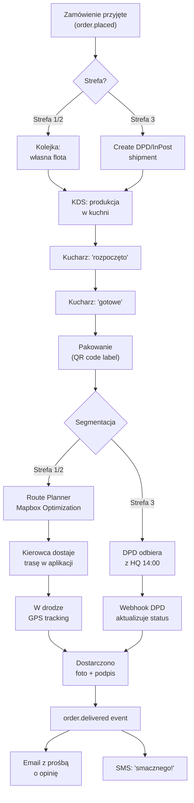

### 10.3 Subskrypcja: pełny lifecycle

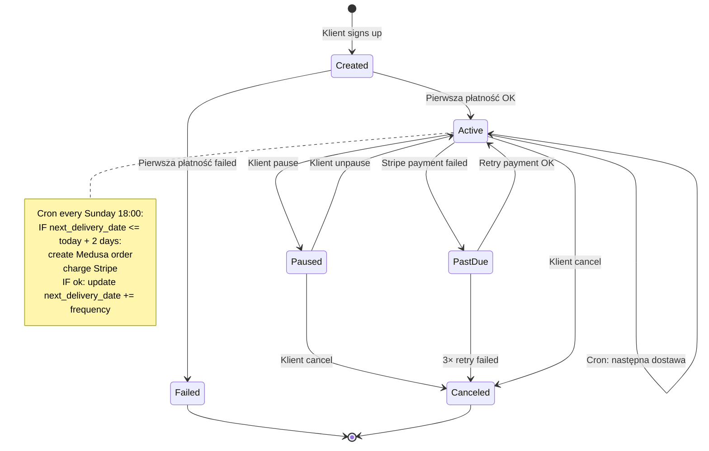

### 10.4 AI Generator menu — flow

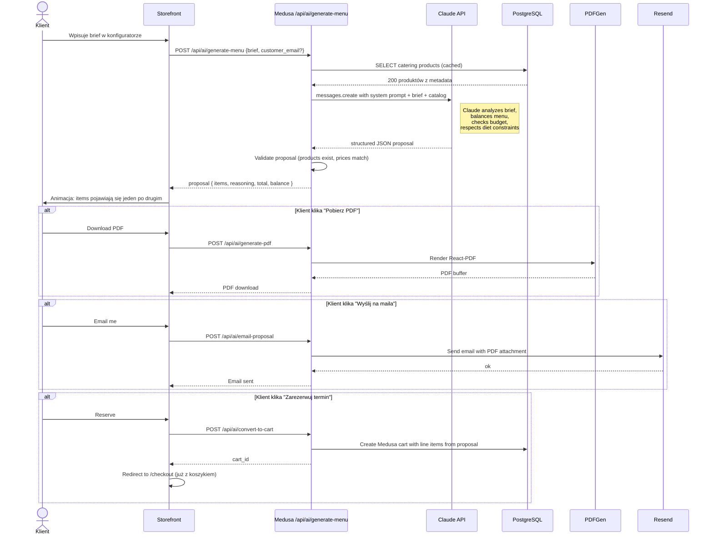

---

## 11. Harmonogram dostarczania (5 sprintów)

### Faza 1 — Fundament Medusa + strefy (3 tygodnie)

**Cel:** działa backend z 1 strefą testową, można utworzyć produkt i zamówić go z fake-payment.

| Task | Czas | Owner |
|---|---|---|
| Setup repo monorepo (Turborepo: storefront + medusa + admin extensions) | 1d | DevOps |
| Medusa 2.0 init + Postgres (Supabase) + Redis (Upstash) | 1d | Backend |
| PostGIS extension + first migrations | 0.5d | Backend |
| Custom module `delivery-zones` (model + service) | 2d | Backend |
| Mapbox Geocoding API integration | 1d | Backend |
| Point-in-polygon API endpoint | 1d | Backend |
| Custom module `time-slots` (model + cron generator) | 2d | Backend |
| Medusa Admin extension: zone editor (z mapą Mapbox) | 3d | Frontend |
| Medusa Admin extension: time slot manager | 2d | Frontend |
| Storefront: Next.js setup + Tailwind + design tokens | 1d | Frontend |
| Storefront: address autocomplete component | 1d | Frontend |
| Deploy do Railway (Medusa) + Vercel (storefront) staging | 1d | DevOps |
| Setup CI/CD (GitHub Actions) | 1d | DevOps |

**Deliverable:** Admin może narysować Strefę 1 na mapie. Storefront wpisując adres pokazuje "Jesteś w Strefie 1". Bazowy backend bez produktów.

### Faza 2 — Katalog + checkout + płatności (4 tygodnie)

**Cel:** klient B2C może zamówić BOX z BLIK-iem, ze slotem czasowym.

| Task | Czas | Owner |
|---|---|---|
| Custom module `product-catering-attributes` | 1d | Backend |
| Custom module `product-zone-availability` | 1d | Backend |
| Import 200 produktów do Medusa (skrypt z CSV) | 2d | Backend |
| Storefront: katalog z filtrami (kategoria, dieta, cena) | 3d | Frontend |
| Storefront: karta produktu | 2d | Frontend |
| Storefront: koszyk + drawer | 2d | Frontend |
| Stripe plugin + setup BLIK w Stripe Dashboard PL | 1d | Backend |
| Checkout flow custom (5 kroków) | 4d | Frontend |
| Time slot reservation workflow (TTL + cleanup cron) | 2d | Backend |
| Fakturownia subscriber + integration | 2d | Backend |
| Resend templates (React Email) | 2d | Frontend |
| SMSAPI integration | 1d | Backend |
| End-to-end test: zamów BOX → płać BLIK → potwierdź | 2d | QA |

**Deliverable:** Pełny sklep B2C live (na razie z fake produktami test). Klient może zamówić, zapłacić BLIK, dostać email + SMS + fakturę VAT (jeśli zaznaczył).

### Faza 3 — Operations (KDS + route planning) (3 tygodnie)

**Cel:** Operacje codzienne wspierane przez admin tool.

| Task | Czas | Owner |
|---|---|---|
| KDS widget w Medusa Admin (lista produkcji per dzień) | 3d | Frontend |
| Mapbox Optimization API integration | 2d | Backend |
| Route Planner widget (mapa + drag&drop) | 4d | Frontend |
| PDF export trasy dla kierowcy | 1d | Frontend |
| Custom module `drivers` + `delivery-routes` + `route-stops` | 2d | Backend |
| Aplikacja mobilna dla kierowcy (PWA / Expo) | 5d | Frontend |
| GPS tracking + status updates | 2d | Backend |
| Proof of delivery (foto upload) | 1d | Backend |

**Deliverable:** Admin widzi wszystkie zamówienia na jutro, optymalizuje trasy, kierowca dostaje aplikację z trasą i statusami.

### Faza 4 — Kurierzy + tracking + subskrypcje (3 tygodnie)

**Cel:** Strefa 3 (krajowa) działa z kurierem. Subskrypcje B2B live.

| Task | Czas | Owner |
|---|---|---|
| DPD API integration (custom Fulfillment Provider) | 3d | Backend |
| Custom module `subscription-plans` | 2d | Backend |
| Stripe Subscriptions wiring | 2d | Backend |
| Storefront: page "Subskrypcja lunch dla biura" | 2d | Frontend |
| Customer dashboard: pause/cancel subskrypcji | 2d | Frontend |
| Cron job: weekly subscription order generation | 1d | Backend |
| Tracking page (status zamówienia z mapy + ETA) | 2d | Frontend |
| DPD webhook handler (statusy) | 1d | Backend |
| Admin: subscription manager widget | 2d | Frontend |

**Deliverable:** Klient z Warszawy zamawia BOX → dostaje DPD tracking number → widzi status na stronie. Firma podpisuje subskrypcję lunch → dostaje co poniedziałek.

### Faza 5 — AI + B2B konfigurator + landing (3-4 tygodnie)

**Cel:** Flagowa różnicowość rynkowa.

| Task | Czas | Owner |
|---|---|---|
| Anthropic Claude API integration | 1d | Backend |
| AI system prompt design + iteration | 2d | Product + Backend |
| Catalog cache dla AI context | 1d | Backend |
| `/api/ai/generate-menu` endpoint | 1d | Backend |
| AI proposal → Medusa cart workflow | 2d | Backend |
| Konfigurator B2B (storefront, 5 kroków) | 4d | Frontend |
| AI Generator mode (brief input) | 2d | Frontend |
| PDF generator (React-PDF) ofert B2B | 2d | Backend |
| Nowy landing page (z STRATEGIA.md design) | 4d | Frontend |
| Migracja produkcyjna (DNS, dane, redirecty) | 2d | DevOps |
| Sanity setup dla content/blog | 2d | Frontend |
| 5 starting blog posts + GEO SEO | 5d | Marketing |
| Performance audit + optimization | 2d | DevOps |

**Deliverable:** Pełny live na cateringslaski.pl. Stary sklep wyłączony. AI Generator dostępny. SEO + GEO optymalizowany.

### Sumarycznie

**Łącznie: ~16 tygodni = 4 miesiące** developmentu (z 1-osobowym backend + 1-osobowym frontend + DevOps part-time).

Z buforem na nieoczekiwane + sesją zdjęciową na początku: **5 miesięcy do pełnej produkcji**.

---

## 12. Risk register

### Top 10 ryzyk + mitygacje

| # | Ryzyko | Prawdopodobieństwo | Wpływ | Mitygacja |
|---|---|---|---|---|
| 1 | **PostGIS performance** przy 1000+ adresach/dzień (point-in-polygon) | Niskie | Wysoki | GIST index na polygon, cache geocoding (Redis), denormalizacja `customer_zone_id` |
| 2 | **Capacity slot race condition** — 2 klientów rezerwuje ostatnie miejsce | Średnie | Średni | Pessimistic locking (SELECT FOR UPDATE), TTL reservations, cron cleanup |
| 3 | **Stripe BLIK quirks** — kod ważny 60 sekund, dziwne błędy | Średnie | Średni | Dobry UX (countdown timer), fallback Przelewy24, retry mechanism |
| 4 | **DPD API niestabilne** — czasem 500 errors | Wysokie | Średni | Queue retries (BullMQ exponential backoff), manual override w admin, fallback InPost |
| 5 | **Sesja zdjęciowa się nie powiedzie** — przed launchem brak food photo | Niskie | Krytyczny | Backup plan: 2 sesje, freelance fotograf + fotograf in-house, fallback stockphoto przejściowo |
| 6 | **Medusa 2.0 breaking changes** w trakcie dev (2.x ciągle ewoluuje) | Średnie | Wysoki | Lock major version, manual upgrade testing, monitoring changelog |
| 7 | **AI generuje błędne menu** (halucinuje produkty których nie ma) | Średnie | Średni | Strict JSON schema validation, fallback "skontaktuj sprzedawcę", human review log |
| 8 | **GDPR / RODO violation** — dane klientów leakage | Niskie | Krytyczny | Data minimization, encrypt PII at rest, audit log, Supabase compliance, regularne pen-testy |
| 9 | **Migracja danych ze starego ec-instant-site** — utrata zamówień historycznych | Średnie | Średni | Skrypt migracyjny + manual review, stara strona dostępna read-only 6 mies, comms do klientów |
| 10 | **Konkurencja kopiuje AI Generator** zanim mamy traction | Wysokie (po 6-12 mies) | Średni | Speed to market (launch w 4-5 mies), branding, content marketing, opatentowanie nazwy "Generator Menu Catering Śląski"? |

### Ryzyka biznesowe (poza tech)

- **Sezonowość**: catering eventowy ma piki (komunie maj-czerwiec, Sylwester). System musi to wytrzymać. → load testing, capacity overflow strategy.
- **Konkurencja cenowa**: lokalna konkurencja może podbijać ceny. → wartość przez AI/UX/jakość, nie cenę.
- **Regulacje food safety**: SANEPID, HACCP. → digital compliance docs in CMS, audit trail.
- **Inflacja składników** 2026: rosną ceny mięsa, jaj. → dynamic pricing engine, alerty admin.

### Co NIE jest ryzykiem (mimo że wygląda)

- **Vendor lock-in Medusa** — to open source, można self-host i exit anytime
- **Vendor lock-in Stripe** — standard branżowy, exit possible via Stripe data export
- **Skalowanie** — Medusa scales horizontally; Vercel + Railway oba autoscale

---

## Appendix A — Decyzje architektoniczne (Architecture Decision Records)

### ADR-001: Medusa.js 2.0 zamiast Sanity-as-commerce

**Status:** Accepted
**Date:** 19 maja 2026

**Context:** Pierwotna propozycja używała Sanity (CMS) + Supabase do budowy commerce od zera.

**Decision:** Use Medusa.js 2.0 as commerce engine. Sanity ograniczone do content.

**Rationale:** Medusa daje out-of-the-box: cart, checkout, orders, customers, subscriptions, admin panel, payment provider abstraction. Oszczędność 2-3 miesięcy dev time. Sanity jako CMS to overkill dla commerce data (no inventory, no order state machine, no payment integration).

**Consequences:**
- (+) Szybszy time-to-market
- (+) Lepsze separation of concerns
- (+) Cleaner extensibility (Medusa modules)
- (-) Konieczne self-hosting Medusa backend (Railway)
- (-) Krzywa nauki Medusa 2.0 (dokumentacja jeszcze rośnie)

### ADR-002: PostGIS zamiast custom geo library

**Status:** Accepted
**Date:** 19 maja 2026

**Context:** Strefy dostawy wymagają polygonów i point-in-polygon queries.

**Decision:** Use PostgreSQL with PostGIS extension. Polygony jako `geometry(MultiPolygon, 4326)`.

**Rationale:** PostGIS to industry standard dla spatial queries. GIST indexes are fast. Supabase i Neon wspierają PostGIS natywnie. Alternatywy (Turf.js w app layer, MongoDB geospatial) są mniej wydajne lub wymagają dodatkowej bazy.

### ADR-003: Railway dla Medusa backend (zamiast Vercel)

**Status:** Accepted
**Date:** 19 maja 2026

**Context:** Medusa wymaga always-on Node.js process (nie serverless friendly z cold starts).

**Decision:** Deploy Medusa na Railway. Storefront pozostaje na Vercel.

**Rationale:** Railway oferuje always-on z $5/mies starter, Postgres + Redis dostępne, cron jobs, łatwe deployment. Vercel Functions mają 10s timeout (zbyt mało dla niektórych workflows AI/route).

**Alternatives considered:** Render (podobny), Fly.io (geo distribution overkill), self-hosted VPS (more ops work).

### ADR-004: Mapbox zamiast Google Maps

**Status:** Accepted (przegłosowane Google)
**Date:** 19 maja 2026

**Rationale:** Mapbox lepszy dla custom polygons editing (Studio), tańszy w Optimization API, lepsze pricing per request, free tier 100k geocoding/mies wystarczy na start.

**Trade-off:** Google ma lepsze polskie dane adresowe w niektórych przypadkach. Można rozważyć hybrid (Mapbox geocoding + Google fallback dla rzadkich adresów).

---

## Appendix B — Estimated monthly costs (production)

Dla volume ~500 zamówień/mies (target Q3 2026):

| Service | Cost | Notes |
|---|---|---|
| Vercel Pro | $20 | storefront |
| Railway | $20-50 | Medusa backend |
| Supabase Pro | $25 | Postgres + auth + storage |
| Upstash Redis | $10 | cache + queues |
| Mapbox | $30 | geocoding + optimization |
| Stripe | 1.4% + 0.25 zł / tx | ~750 zł/mies przy 500 zamówieniach × 300 zł |
| Resend | $20 | email |
| SMSAPI | $30 | SMS |
| Fakturownia | $15 | faktury |
| Anthropic Claude API | $50-100 | AI Generator |
| Cloudinary | $0 (free tier) | media |
| Sanity | $0 (free tier) | content |
| Sentry | $0 (free tier) | errors |
| PostHog | $0 (free tier) | analytics |
| Domains + SSL | $5 | cateringslaski.pl |
| **TOTAL** | **~$300-400/mies (~1500 zł)** | scaling with revenue |

vs. Shopify Plus ~$2000/mies fix + transaction fees.

---

## Appendix C — Glossary

- **Strefa** (delivery_zone): polygon geograficzny z zestawem reguł dostawy
- **Okienko** (time_slot): konkretne 2-godzinne okno w danym dniu w danej strefie
- **Lead time**: liczba dni pomiędzy złożeniem zamówienia a dostawą
- **Cutoff**: godzina graniczna złożenia zamówienia na dany lead time
- **KDS** (Kitchen Display System): widok kuchenny ze wszystkimi pozycjami do ugotowania
- **VRP** (Vehicle Routing Problem): klasyczny problem optymalizacji tras
- **GEO SEO** (Generative Engine Optimization): pozycjonowanie pod AI search (ChatGPT, Perplexity, Gemini)
- **KSeF**: Krajowy System e-Faktur, polski standard fakturowania (obowiązkowy od 2026)

---

## Następne kroki

1. **Akceptacja dokumentu** przez właściciela / zespół
2. **Setup repozytorium** (Turborepo monorepo)
3. **Faza 1 kick-off** — start od Medusa setup + strefy
4. **Sesja zdjęciowa 50 top BOXów** — równolegle z dev (priorytet jakości)
5. **Recruit/contract**: 1 backend + 1 frontend + 1 DevOps part-time = minimum team

---

*Dokument jest żywy — będzie aktualizowany w trakcie projektu. Każda decyzja architektoniczna powyżej akceptowalna do zmiany jeśli dane z fazy 1 ją podważą.*

*Wersja 2.0 · 19 maja 2026 · Catering Śląski redesign*
