# Catering Śląski — Specyfikacja Sklepu Zamówieniowego

**Wersja:** 3.0
**Data:** 19 maja 2026
**Status:** Draft do akceptacji
**Scope:** Sklep zamówieniowy + integracja z istniejącymi systemami operacyjnymi
**Stack:** Next.js 15 + Medusa.js 2.0 + PostgreSQL/PostGIS + Stripe
**Autor:** Claude (autonomiczna sesja Cowork)

> **Uwaga merytoryczna:** Ten dokument zastępuje `CATERING_SHOP_FULL_SPEC.md` (v2). Wcześniejsza wersja zakładała budowę pełnej platformy od zera, włącznie z KDS, route planningiem, fakturowaniem. **Po sprecyzowaniu scope z właścicielem: te systemy już istnieją.** My budujemy TYLKO sklep + integracje webhook do istniejących systemów.

---

## Spis treści

1. [Scope — co budujemy, czego NIE](#1-scope)
2. [Architektura systemu i granice odpowiedzialności](#2-architektura)
3. [Frontend sklepu](#3-frontend-sklepu)
4. [Medusa backend](#4-medusa-backend)
5. [Strefy dostawy](#5-strefy-dostawy)
6. [Okienka czasowe i capacity](#6-okienka-czasowe)
7. [Subskrypcje cateringowe](#7-subskrypcje)
8. [Promocje, loyalty, referral](#8-promocje)
9. [Konto klienta](#9-konto-klienta)
10. [Webhooks OUT — 3 integracje](#10-webhooks)
11. [Schema bazy danych (tylko sklep)](#11-schema-db)
12. [Mermaid diagramy przepływów](#12-diagramy)
13. [Harmonogram (3 sprinty, ~10 tygodni)](#13-harmonogram)
14. [Risk register](#14-risks)
15. [Appendix — webhook contracts (OpenAPI-style)](#15-appendix)

---

## 1. Scope

### 1.1 Co budujemy ✅

| Element | Opis |
|---|---|
| **Storefront B2C/B2B** | Frontend Next.js — katalog, koszyk, checkout, konto |
| **Medusa backend** | Commerce engine — produkty, zamówienia, klienci, płatności |
| **Strefy dostawy** | Polygony + address-to-zone matching + dostępność produktów per strefa |
| **Okienka czasowe** | Capacity, pessimistic locking, deadline countdown |
| **Płatności** | Stripe (BLIK, karta, Apple/Google Pay), płatności jednorazowe + subskrypcje |
| **Subskrypcje** | Auto-renewal boxów cateringowych z opcją pause/modify/cancel |
| **Promocje** | Kody rabatowe, auto-zniżki, loyalty tiers, referral program |
| **Konto klienta** | Profil, preferencje dietetyczne, historia, ulubione, lista subskrypcji |
| **Admin sklepu** | Zarządzanie produktami, strefami, okienkami, promocjami, klientami |
| **Webhooks OUT** | 3 integracje wychodzące do istniejących systemów (produkcja, logistyka, rozliczenia) |

### 1.2 Czego NIE budujemy ❌ — to już istnieje

| System istniejący | Co robi | Jak go integrujemy |
|---|---|---|
| **System zarządzania produkcją** | Planuje co kucharze gotują, kiedy, KDS, statusy produkcji | Sklep wysyła webhook z zamówieniem (co + ile + kiedy potrzebne) |
| **System logistyki dostaw** | Route planning, kierowcy, GPS, odbiory osobiste | Sklep wysyła webhook z adresem + strefą + okienkiem + kontaktem |
| **Aplikacja rozliczeń / faktur** | Faktury VAT, KSeF, księgowość, raporty finansowe | Sklep wysyła webhook z danymi zamówienia (kwoty, VAT, dane klienta) |

### 1.3 Boundary diagram

```mermaid
flowchart LR
    subgraph NaszSystem["SKLEP (my budujemy)"]
        Frontend[Frontend Next.js]
        Backend[Medusa Backend]
        DB[(PostgreSQL/PostGIS)]
        Stripe[Stripe]
    end

    subgraph IstniejaceSystemy["ISTNIEJĄCE SYSTEMY (poza scope)"]
        Produkcja[System produkcji<br/>KDS, planowanie]
        Logistyka[System logistyki<br/>route, kierowcy]
        Rozliczenia[Rozliczenia<br/>faktury, KSeF]
    end

    Frontend --> Backend
    Backend --> DB
    Backend --> Stripe

    Backend -.webhook 1.->|order.placed| Produkcja
    Backend -.webhook 2.->|order.placed| Logistyka
    Backend -.webhook 3.->|order.placed + paid| Rozliczenia

    Produkcja -.optional webhook.->|status update| Backend
    Logistyka -.optional webhook.->|delivery status| Backend

    style NaszSystem fill:#1a3a26,stroke:#C9A961,color:#F4EFE6
    style IstniejaceSystemy fill:#221C18,stroke:#7E6630,color:#D8CCB4
```

### 1.4 Co to oznacza dla zespołu

- **Mniej kodu** — szacunkowo 40% redukcja vs v2
- **Mniej ryzyka** — nie ingerujemy w operations team, nie zmieniamy ich workflow
- **Większy focus** — robimy jedną rzecz dobrze: doświadczenie zakupowe + przekazanie zamówienia dalej
- **Krytyczne staje się**: webhook contracts (must be bulletproof), bo to jedyne punkty łączenia z resztą firmy
- **Krócej do produkcji**: ~10 tygodni zamiast 16

---

## 2. Architektura systemu i granice odpowiedzialności

### 2.1 Wysokopoziomowy diagram

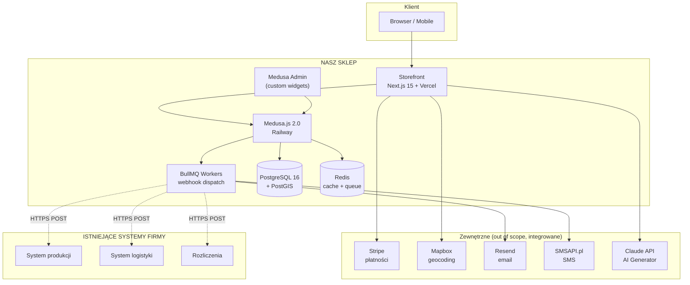

### 2.2 Co należy do sklepu, a co do innych systemów

| Funkcjonalność | W naszym sklepie? | W istniejącym systemie? |
|---|---|---|
| Katalog produktów (frontend) | ✅ | — |
| Receptury, składniki, gotowanie | ❌ | ✅ System produkcji |
| Inventory składników (mąka, mięso) | ❌ | ✅ System produkcji |
| Kalendarz produkcji | ❌ | ✅ System produkcji |
| Statusy produkcji (rozpoczęto / gotowe / spakowane) | ❌ (read-only przez webhook IN) | ✅ System produkcji |
| Strefy dostawy (definicja polygonów) | ✅ (geograficzny matching) | ❌ |
| Konkretne trasy kierowców | ❌ | ✅ System logistyki |
| Faktura VAT, KSeF, księgowanie | ❌ | ✅ Rozliczenia |
| Płatność klienta (Stripe) | ✅ | — |
| Przepływ pieniędzy do firmy | ❌ | ✅ Rozliczenia |
| Promocje, kody, loyalty | ✅ | — |
| Subskrypcje produktów | ✅ | — |
| Konto klienta + historia | ✅ | — |

**Złota zasada:** wszystko **do złożenia zamówienia i jego opłacenia** jest u nas. Wszystko **po zamówieniu** (gotowanie, dostarczanie, fakturowanie) jest w innych systemach.

### 2.3 Komunikacja sklep ↔ systemy istniejące

**Komunikacja jednokierunkowa (sklep → systemy):**
- Webhook OUT przy `order.placed` (lub `order.paid` dla rozliczeń)
- Sklep nie czeka na odpowiedź — fire-and-retry z BullMQ
- Każdy system ma idempotency key = nasz `order.id`

**Komunikacja opcjonalna (systemy → sklep):**
- Webhook IN z systemu produkcji: status zamówienia (np. "spakowane") → aktualizujemy `order.metadata.production_status`
- Webhook IN z systemu logistyki: status dostawy (np. "kierowca w drodze") → aktualizujemy `order.metadata.delivery_status`
- Pokazujemy klientowi w `/account/orders/:id`

Te webhooki IN to **nice-to-have** dla customer experience. Nie blokują core flow.

---

## 3. Frontend sklepu

### 3.1 Strony / routes

| Route | Cel | RSC/CSR |
|---|---|---|
| `/` | Landing (hero, USP, kategorie, AI teaser, social proof) | RSC |
| `/menu` | Katalog produktów z filtrami | RSC + CSR filters |
| `/menu/[kategoria]` | Sub-katalog (np. /menu/boxy) | RSC |
| `/produkt/[slug]` | Karta produktu | RSC |
| `/koszyk` | Koszyk | CSR (state) |
| `/checkout` | Checkout 5-stepowy | CSR (form state) |
| `/zamowienie/[id]/sukces` | Potwierdzenie zamówienia | RSC |
| `/konto` | Dashboard klienta | RSC + CSR |
| `/konto/zamowienia` | Historia zamówień | RSC |
| `/konto/zamowienia/[id]` | Szczegóły + status (z webhook IN) | RSC + polling |
| `/konto/subskrypcje` | Zarządzanie subskrypcjami | CSR |
| `/konto/ulubione` | Lista ulubionych | RSC |
| `/konto/preferencje` | Dieta, alergie, adres domyślny | CSR |
| `/konfigurator` | B2B konfigurator z AI Generator | CSR (heavy interactive) |
| `/strefy-dostawy` | Mapa stref + sprawdzanie kodu pocztowego | CSR |
| `/blog/[slug]` | Artykuły (Sanity) | RSC |
| `/o-nas`, `/kontakt`, `/regulamin` itd. | Statyczne | RSC |

### 3.2 Komponenty UI — kluczowe

**Address Picker (krytyczny dla cateringu)**
- Mapbox Search Box (autocomplete)
- Po wybraniu adresu: pinpoint na mini-mapie + nazwa strefy ("Strefa Lokalna")
- Komunikat z dostępnymi kategoriami: "Dostępne: wszystkie kategorie • Najwcześniejsza dostawa: jutro"
- Edge case: adres poza strefami → "Możemy dostarczyć kurierem (Strefa Krajowa) lub odebrać osobiście"

**Date+Slot Picker**
- Kalendarz disabled przed effective lead time
- Po wybraniu daty: lista 4 okienek z liczbą `available`
- Sloty pełne: szare + tooltip
- Timer 15 min po rezerwacji

**Product Card** (lista)
- Zdjęcie 1:1 (ratio kwadrat dla mobile + desktop)
- Badge `bestseller`, `wege`, `nowość`, `tylko w strefie 1` itd.
- Nazwa, krótki opis (1 linijka)
- Cena, ★ ocena, liczba osób
- Hover: szybki dodaj do koszyka

**Product Detail**
- Galeria zdjęć (4-6 fotek)
- Wybór wariantu (jeśli istnieje: rozmiar, dieta)
- Składniki + alergeny + diet tags
- Wartości odżywcze (jeśli relevant)
- "Pasuje do" — cross-sell AI suggestion
- Sticky CTA na mobile

**Cart Drawer**
- Otwiera się sliding-from-right
- Lista pozycji + total
- Quick edit qty / remove
- "Przejdź do dostawy" CTA

**Checkout Stepper** (z `04-checkout.html` mockup)
- 5 sekcji rozwijających się
- Order summary sticky po prawej (lub drawer na mobile)
- Validation per-step
- Stripe Elements embed dla płatności

### 3.3 Performance targets

- **LCP (Largest Contentful Paint):** < 1.5s (mobile 4G)
- **CLS (Cumulative Layout Shift):** < 0.1
- **INP (Interaction to Next Paint):** < 200ms
- **TTFB (Time to First Byte):** < 800ms

**Jak osiągamy:**
- Next.js 15 RSC (server rendering, mniej JS na klienta)
- Image optimization (`next/image` + Cloudinary)
- Streaming SSR dla katalogu (lazy load below the fold)
- Tailwind + critical CSS inline
- Edge functions Vercel dla geo-personalizacji
- Preconnect dla Mapbox + Stripe

### 3.4 SEO + GEO (krótko)

- Schema.org `Product` na każdej karcie produktu (cena, dostępność, oceny)
- Schema.org `LocalBusiness` na landingu
- Schema.org `FAQPage` w FAQ
- Sitemap XML auto-generowany
- Canonical URLs
- Open Graph dla każdej strony (z prawdziwym og:image!)
- AI search optimization: FAQ pages z konkretnymi pytaniami ("Ile finger foodów na osobę?")

---

## 4. Medusa backend

### 4.1 Custom modules — własne moduły poza Medusa core

```
medusa/src/modules/
├── delivery-zones/             # Strefy z polygonami
│   ├── models/
│   │   └── delivery-zone.ts
│   ├── service.ts
│   ├── workflows/
│   │   └── match-address-to-zone.ts
│   └── index.ts
│
├── time-slots/                  # Okienka czasowe
│   ├── models/
│   │   ├── time-slot.ts
│   │   └── slot-reservation.ts
│   ├── service.ts
│   ├── workflows/
│   │   ├── reserve-slot.ts
│   │   ├── confirm-slot.ts
│   │   └── release-expired-slots.ts (cron)
│   └── index.ts
│
├── catering-attributes/         # Dodatkowe atrybuty produktów
│   ├── models/
│   │   └── product-catering-attribute.ts
│   ├── models/
│   │   └── product-zone-availability.ts
│   ├── service.ts
│   └── index.ts
│
├── subscriptions/               # Subskrypcje cateringowe
│   ├── models/
│   │   ├── subscription.ts
│   │   └── subscription-cycle.ts
│   ├── service.ts
│   ├── workflows/
│   │   ├── create-subscription.ts
│   │   ├── pause-subscription.ts
│   │   ├── cancel-subscription.ts
│   │   └── generate-next-cycle.ts (cron)
│   └── index.ts
│
├── promotions/                  # Loyalty + referral (rozszerzenie Medusa Promotions)
│   ├── models/
│   │   ├── loyalty-tier.ts
│   │   ├── referral-code.ts
│   │   └── customer-loyalty-state.ts
│   ├── service.ts
│   └── index.ts
│
├── customer-preferences/        # Preferencje dietetyczne, alergie
│   ├── models/
│   │   └── customer-preference.ts
│   └── index.ts
│
└── external-webhooks/           # Webhook dispatch do istniejących systemów
    ├── workflows/
    │   ├── dispatch-production.ts
    │   ├── dispatch-logistics.ts
    │   └── dispatch-billing.ts
    ├── subscribers/
    │   ├── order-placed.ts        # main entry point
    │   └── order-paid.ts
    ├── service.ts                 # HTTP client + retry logic
    └── index.ts
```

### 4.2 Medusa core moduły używane bez modyfikacji

- **Cart** — koszyk + sesje
- **Order** — zamówienia (rozszerzamy o `metadata` dla catering-specific data)
- **Customer** — klienci (rozszerzamy o `customer-preferences`)
- **Product** — produkty (rozszerzamy o `catering-attributes`)
- **Region** — używamy regionu "PL"
- **Currency** — PLN
- **Tax** — 8% (catering = żywność)
- **Payment** — Stripe provider (BLIK + karta)
- **Promotion** — kody rabatowe (rozszerzamy o loyalty/referral)

### 4.3 Workflows (composable business logic)

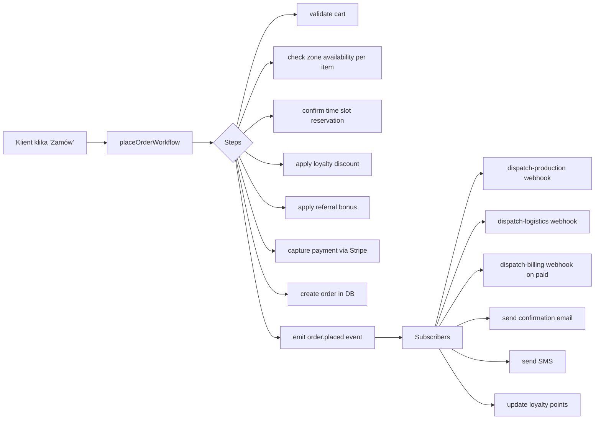

Workflow ma compensation steps — jeśli `capture payment` fails, slot reservation jest released, loyalty points NIE są dodane.

---

## 5. Strefy dostawy

### 5.1 Model 3 stref (configurable n-stref)

| Strefa | Cutoff | Lead time | Transport | Dostępne kategorie | Cena dostawy |
|---|---|---|---|---|---|
| **LOKALNA** (centrum Śląska, ~15km) | 09:00 (dziś!) | 0 dni | Własna flota | wszystko | 0-15 zł |
| **REGIONALNA** (Śląsk + okolice, ~50km) | 18:00 | 1 dzień | Własna flota / kurier lokalny | wszystko | 19-29 zł |
| **KRAJOWA** (cała PL) | 18:00 | 2 dni | Kurier (DPD/InPost) | TYLKO catering boxes | 25-45 zł |

Każda strefa to **polygon** rysowany w admin na mapie.

### 5.2 Address-to-zone flow

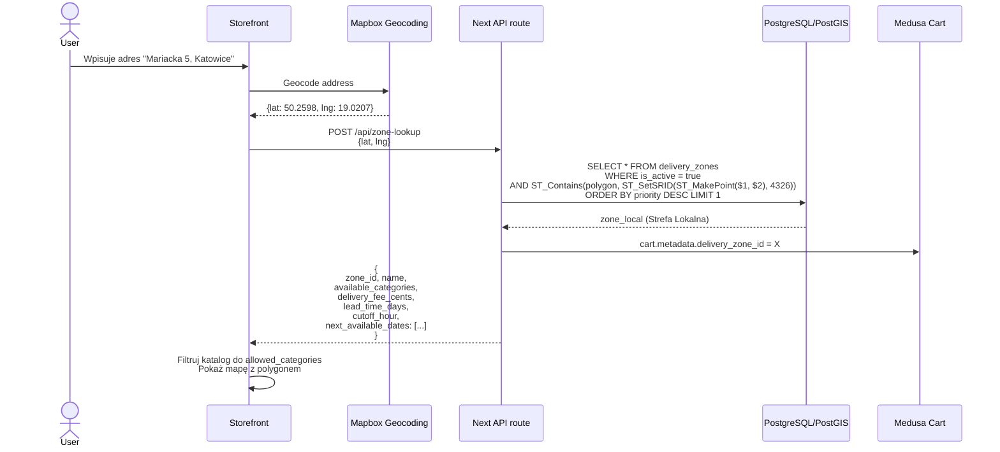

### 5.3 Priorytetyzacja (overlapping polygons)

Strefa Lokalna (priority=300) zawiera się w Regionalnej (priority=200) zawiera się w Krajowej (priority=100). Klient z Katowic dostaje **najlepszą** (Lokalną) automatycznie.

### 5.4 Punkty odbioru (poza strefami)

Dla adresów poza wszystkimi polygonami pokazujemy:
1. **Odbiór osobisty** w punkcie HQ
2. **Paczkomat InPost** najbliższy adresowi (z chłodnią — sprawdzenie operacyjne required)

### 5.5 Edge case: adres na granicy

Klient z Tychów może być w Strefie Regionalnej. Pokazujemy info:
> "Jesteś w Strefie Regionalnej. Dostawa jutro między 12:00-14:00 za 29 zł. Możesz też odebrać osobiście w Dąbrowie Górniczej (gratis)."

---

## 6. Okienka czasowe i capacity

### 6.1 Model

Każda strefa ma **template** okienek (per dzień tygodnia, bo np. w weekend inne godziny):

```typescript
const templates = {
  'zone_local': {
    monday_to_friday: [
      { time_from: '10:00', time_to: '12:00', capacity: 25 },
      { time_from: '12:00', time_to: '14:00', capacity: 30 },
      { time_from: '14:00', time_to: '16:00', capacity: 25 },
      { time_from: '16:00', time_to: '18:00', capacity: 20 }
    ],
    saturday_sunday: [
      { time_from: '10:00', time_to: '14:00', capacity: 35 },
      { time_from: '14:00', time_to: '18:00', capacity: 35 }
    ]
  },
  'zone_regional': {
    every_day: [
      { time_from: '10:00', time_to: '14:00', capacity: 40 },
      { time_from: '14:00', time_to: '18:00', capacity: 40 }
    ]
  },
  'zone_national': {
    every_day: [
      { time_from: '00:00', time_to: '23:59', capacity: 100 }
      // kurier — bez konkretnego okienka
    ]
  }
}
```

### 6.2 Generowanie slotów (cron)

Nightly cron job (BullMQ schedule):
1. Dla każdej aktywnej strefy
2. Dla każdej daty w T+1..T+30
3. Pobierz template dla dnia tygodnia
4. INSERT slotów (z `ON CONFLICT DO NOTHING` — idempotent)
5. Skip dla dat zablokowanych (święta, urlop)

### 6.3 Pessimistic locking — KRYTYCZNE

Dwóch klientów próbuje zarezerwować ostatni slot — tylko jeden wygrywa.

```sql
BEGIN;

-- Lock row
SELECT * FROM delivery_time_slots
WHERE id = $1
FOR UPDATE;

-- Check capacity
IF booked_count < capacity THEN
  UPDATE delivery_time_slots
  SET booked_count = booked_count + 1
  WHERE id = $1;

  INSERT INTO slot_reservations (slot_id, cart_id, expires_at)
  VALUES ($1, $2, NOW() + INTERVAL '15 minutes');

  COMMIT;
ELSE
  ROLLBACK;
  -- return "slot full"
END IF;
```

Po 15 minutach bez płatności — cron releases:
```sql
WITH expired AS (
  DELETE FROM slot_reservations
  WHERE expires_at < NOW() AND status = 'pending'
  RETURNING slot_id
)
UPDATE delivery_time_slots
SET booked_count = booked_count - 1
WHERE id IN (SELECT slot_id FROM expired);
```

### 6.4 Wyświetlanie dostępności klientowi

API endpoint `/api/time-slots?zone_id=X&date=Y`:

```json
{
  "zone_id": "zone_local",
  "date": "2026-05-20",
  "cutoff_passed": false,
  "slots": [
    {
      "id": "ts_abc",
      "from": "10:00",
      "to": "12:00",
      "capacity": 25,
      "booked": 18,
      "available": 7,
      "status": "open"
    },
    {
      "id": "ts_def",
      "from": "12:00",
      "to": "14:00",
      "capacity": 30,
      "booked": 30,
      "available": 0,
      "status": "full"
    },
    ...
  ]
}
```

UI: pełne sloty disabled z tooltip "Wszystkie miejsca zajęte — spróbuj inną datę".

### 6.5 Deadline countdown

Storefront pokazuje sticky banner:
> ⏰ Zamów do **16:00 dzisiaj**, dostarczymy jutro. Pozostało: **02:34:18**

Po przekroczeniu cutoff: lead time +1 dzień automatycznie.

---

## 7. Subskrypcje cateringowe

### 7.1 Model

Subskrypcja = **plan** który generuje cykliczne zamówienia.

| Pole | Przykład |
|---|---|
| Plan name | "Lunch firmowy dla biura, 5 dni/tydz, 10 osób" |
| Frequency | weekly / bi_weekly / monthly |
| Product set | `[{box_lunch_premium: 10}]` lub rotating menu |
| Delivery day | Poniedziałek, środa, piątek |
| Delivery zone + slot template | Strefa Lokalna, 12:00-14:00 |
| Stripe subscription_id | sub_xxx |
| Status | active / paused / canceled / past_due |
| Next delivery date | 2026-05-26 |

### 7.2 Lifecycle

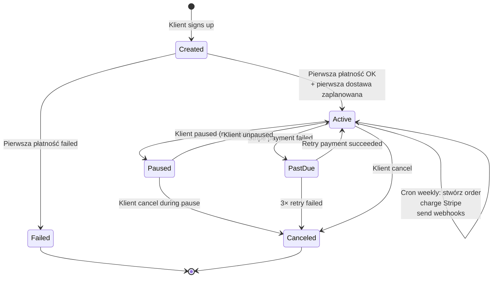

### 7.3 Auto-renewal cron

Co niedzielę o 18:00 (BullMQ scheduled):
1. SELECT subskrypcje WHERE `next_delivery_date <= now() + 2 days` AND `status = 'active'`
2. Dla każdej:
   - Stwórz Medusa Order z product_set
   - Charge Stripe via subscription
   - Jeśli OK: update `next_delivery_date += frequency_interval`
   - Wyślij webhooki out (produkcja, logistyka)
   - Email do klienta "kolejna dostawa jutro"
3. Failed payments → status `past_due` + retry strategy

### 7.4 Klient może

- **Pause** — wybiera "do kiedy" (max 30 dni), w trakcie nie ma dostaw, nie płaci
- **Modify menu** — zmiana product_set od następnego cyklu
- **Modify dieta** — np. dodanie "vege" → rotacja menu uwzględnia
- **Change address** — od następnego cyklu
- **Skip next delivery** — single skip bez pausy
- **Cancel** — natychmiastowy, bez kar (good practice)

### 7.5 Rotacja menu

Dla subskrypcji "lunch dla biura" klient nie chce co tydzień tego samego. **Rotation engine**:
- Plan ma `rotation_pool` — pula 20-30 produktów spełniających kryteria (np. wege, max 800 kcal, max 25 zł/szt)
- Algorytm: dla każdego cyklu wybierz 5 produktów z pool, nie powtarzaj z ostatnich 2 cyklów
- Klient może wykluczyć konkretne produkty ("nie lubię kurczaka curry")
- Klient widzi proponowane menu na T+3 dni przed dostawą — może modyfikować

---

## 8. Promocje, loyalty, referral

### 8.1 Trzy mechanizmy

| Mechanizm | Co to | Przykład |
|---|---|---|
| **Kody promocyjne** | Discrete kody jednorazowe lub multi-use | `WIOSNA2026` = -15% |
| **Auto-zniżki** | Reguły auto applied (bez kodu) | "Drugi BOX 50% off jeśli koszyk > 500 zł" |
| **Loyalty tiers** | Tier-based zniżki dla stałych klientów | Gold = stały -10%, Platinum = -15% |
| **Referral** | Klient poleca → oboje dostają bonus | -50 zł dla obu po pierwszym zamówieniu polecanego |

### 8.2 Kody promocyjne (Medusa Promotions)

Medusa 2.0 ma built-in Promotion module z regułami:

```typescript
{
  code: "KOMUNIA2026",
  type: "percentage", // lub fixed_amount
  value: 15, // 15%
  rules: [
    { attribute: "items.product.category", operator: "in", value: ["komunia_special"] },
    { attribute: "cart.subtotal_cents", operator: "gte", value: 50000 } // min 500 zł
  ],
  starts_at: "2026-04-01",
  ends_at: "2026-06-30",
  usage_limit: 100, // max 100 użyć
  usage_per_customer: 1 // max 1× na klienta
}
```

Admin UI: tabela kodów z statystykami (ile użyte, ile pozostało, łączny rabat).

### 8.3 Loyalty tiers

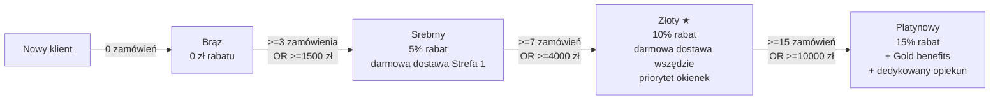

Tiery są **rolling 12-month window** — klient utrzymuje status jeśli w ostatnich 12 mies. spełnia próg.

Tabela `customer_loyalty_state`:
- customer_id
- current_tier
- lifetime_orders_count
- lifetime_spent_cents
- rolling_12m_orders_count
- rolling_12m_spent_cents
- tier_attained_at
- tier_expires_at (jeśli nie spełnia rolling)

Cron daily: re-calculate dla każdego klienta.

### 8.4 Referral program

Mechanizm:
1. Klient X dostaje swój referral code (np. `REF-REMEK-A3F2`)
2. Klient X share link `https://cateringslaski.pl/?ref=REF-REMEK-A3F2`
3. Nowy klient Y wchodzi przez link → cookie 30 dni
4. Klient Y robi pierwsze zamówienie ≥ 200 zł
5. Po opłaceniu:
   - Klient Y dostaje **-50 zł** zniżki na to zamówienie
   - Klient X dostaje **50 zł kredyt** na swoje następne zamówienie

Tabela `referral_codes`:
- code (unique)
- referrer_customer_id
- created_at
- total_referrals
- total_payouts_cents

Tabela `referral_redemptions`:
- code
- referred_customer_id
- order_id (pierwsze zamówienie)
- referrer_credit_amount_cents
- referred_discount_amount_cents
- status (pending / paid / refunded)

### 8.5 Combine rules

Klient może mieć: kod `KOMUNIA2026` (-15%) + loyalty Gold (-10%) + dostawa darmowa.

**Decyzja**: rabaty NIE są stackowane multiplikatywnie. Aplikowany jest **najwyższy** rabat z list (kod LUB loyalty), darmowa dostawa zawsze osobno. UI pokazuje: "Zastosowaliśmy najlepszy rabat: KOMUNIA2026 (-15%)".

Admin może override (np. "stackuj loyalty + kody dla VIP").

---

## 9. Konto klienta

### 9.1 Sekcje dashboardu

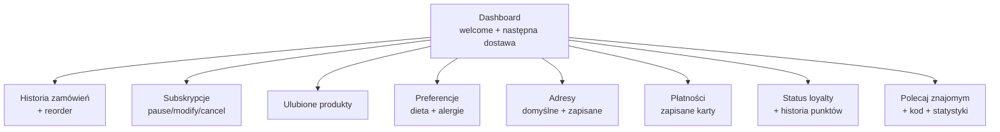

### 9.2 Preferencje dietetyczne

Klient zapisuje swoje preferencje raz — wpływają na rekomendacje i filtry domyślne:

```json
{
  "diet": ["vege", "lactose_free"],
  "allergens_avoid": ["nuts", "eggs"],
  "dislikes": ["mushrooms", "olives"],
  "favorite_cuisines": ["italian", "polish"],
  "default_portions": 2,
  "default_zone_id": "zone_local",
  "marketing_consent": true
}
```

### 9.3 Reorder

Każde zamówienie ma button "Zamów ponownie":
- Kopiuje wszystkie items
- Dodaje do koszyka
- Klient tylko wybiera nową datę/slot

### 9.4 Tracking zamówienia

Strona `/konto/zamowienia/[id]` pokazuje status z webhook IN (jeśli zintegrowane):

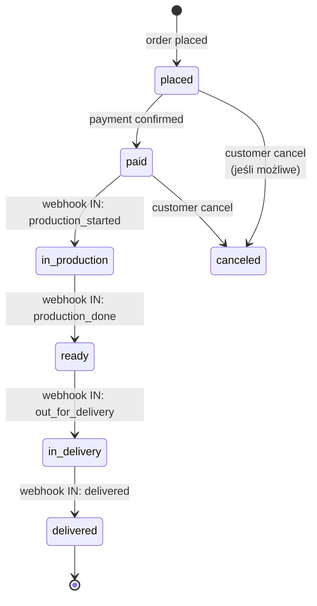

Jeśli system produkcji/logistyki NIE wysyła webhook IN — pokazujemy tylko `placed` → `paid` → `confirmed for delivery [date/slot]`.

---

## 10. Webhooks OUT — 3 integracje

To **najważniejsza sekcja** tego dokumentu. Te webhooki są jedynym punktem łączenia z resztą firmy.

### 10.1 Zasady ogólne

**Wszystkie 3 webhooki:**

- **Transport:** HTTPS POST
- **Authentication:** HMAC-SHA256 signature w nagłówku `X-Webhook-Signature` (shared secret per system)
- **Idempotency:** nagłówek `X-Idempotency-Key` = `order.id` (system odbiorcy musi obsłużyć duplicate)
- **Timeout:** 10s na response
- **Retry:** exponential backoff (1s, 5s, 30s, 5min, 30min, 2h, 12h) — max 7 prób
- **Dead Letter Queue:** po 7 nieudanych próbach → manual alert + DLQ table w naszej DB
- **Idempotency od naszej strony:** każdy webhook ma `event_id` (UUID) — jeśli wysyłany ponownie, ten sam event_id

**Content-Type:** `application/json`
**Charset:** UTF-8
**Versioning:** nagłówek `X-Webhook-Version: 1` (przyszłe v2 będą wstecznie kompatybilne lub osobnym endpointem)

### 10.2 Webhook #1 — System produkcji

**Cel:** powiadomić co ugotować, ile, kiedy potrzebne.

**Endpoint (konfigurowalny przez admin sklepu):** np. `https://produkcja.cateringslaski.local/api/v1/orders/incoming`

**Trigger:** `order.placed` event (zaraz po confirm — niezależnie od stanu płatności, żeby kuchnia miała wczesny sygnał) ALBO `order.paid` (jeśli wolimy bezpieczniej — konfigurowalne)

**Payload:**

```json
{
  "event_id": "evt_01HX7Y3K9M5N2P4Q6R8S0T2V",
  "event_type": "order.placed",
  "event_timestamp": "2026-05-19T14:32:18.456Z",
  "webhook_version": "1",

  "order": {
    "id": "order_01HX7Y2A0B1C2D3E4F5G6H7J",
    "display_number": "CS-2026-04812",
    "placed_at": "2026-05-19T14:32:17.123Z",
    "source": "storefront",
    "payment_status": "captured",
    "currency": "PLN"
  },

  "delivery": {
    "requested_date": "2026-05-20",
    "time_slot": {
      "from": "12:00",
      "to": "14:00"
    },
    "zone": {
      "id": "zone_local",
      "name": "Strefa Lokalna",
      "delivery_method": "own_fleet"
    },
    "address": {
      "first_name": "Anna",
      "last_name": "Kowalska",
      "street": "Mariacka 5",
      "city": "Katowice",
      "postal_code": "40-014",
      "country_code": "PL",
      "lat": 50.2598,
      "lng": 19.0207,
      "delivery_instructions": "Drugie piętro, kod 1234"
    },
    "contact": {
      "email": "anna@example.com",
      "phone": "+48 600 100 200"
    }
  },

  "items": [
    {
      "product_id": "prod_box_koktajl_ii",
      "sku": "BOX-KKT-II",
      "name": "BOX koktajlowy II",
      "category": "catering_boxes",
      "production_lead_time_days": 1,
      "packaging_type": "wooden_box",
      "temperature_constraint": "room_temp",
      "portions": 10,
      "quantity": 2,
      "variant": null,
      "diet_tags": [],
      "allergens": ["eggs", "milk", "gluten"],
      "customer_note": null
    },
    {
      "product_id": "prod_box_salatkowy",
      "sku": "BOX-SAL",
      "name": "BOX sałatkowy",
      "category": "catering_boxes",
      "production_lead_time_days": 1,
      "packaging_type": "wooden_box",
      "temperature_constraint": "cold",
      "portions": 8,
      "quantity": 1,
      "variant": null,
      "diet_tags": ["vege"],
      "allergens": [],
      "customer_note": "Dla osób z alergią na orzechy"
    }
  ],

  "customer_preferences": {
    "diet": ["vege"],
    "allergens_avoid": ["nuts"],
    "dislikes": []
  },

  "total_portions_estimated": 28,
  "preparation_deadline": "2026-05-20T11:00:00+02:00"
}
```

**Co system produkcji robi po otrzymaniu:**
- Dodaje zamówienie do swojego planera kuchni
- Generuje shopping list składników
- Planuje czas produkcji
- (Opcjonalnie) wysyła webhook IN do sklepu z `production_started` / `production_done`

**Odpowiedź oczekiwana:**
```http
HTTP/1.1 200 OK
Content-Type: application/json

{
  "received": true,
  "event_id": "evt_01HX7Y3K9M5N2P4Q6R8S0T2V",
  "production_id": "prod_2026_04812"
}
```

**Błędy (nasza obsługa):**
- `2xx` → success, mark webhook delivered
- `4xx` (poza 429) → log error, alert ops, NIE retry (zły payload, problem strukturalny)
- `5xx` lub `429` → retry z backoff
- Timeout → retry

### 10.3 Webhook #2 — System logistyki

**Cel:** powiadomić gdzie i kiedy dostarczyć.

**Endpoint:** np. `https://logistyka.cateringslaski.local/api/v1/deliveries/incoming`

**Trigger:** `order.paid` event (po potwierdzonej płatności — wcześniej nie ma sensu planować trasy)

**Payload:**

```json
{
  "event_id": "evt_01HX7Y4L0N6P3Q5R7S9T1V3W",
  "event_type": "order.paid",
  "event_timestamp": "2026-05-19T14:32:25.789Z",
  "webhook_version": "1",

  "order": {
    "id": "order_01HX7Y2A0B1C2D3E4F5G6H7J",
    "display_number": "CS-2026-04812",
    "paid_at": "2026-05-19T14:32:24.567Z"
  },

  "delivery_request": {
    "type": "own_fleet",
    "requested_date": "2026-05-20",
    "time_slot": {
      "id": "ts_2026_05_20_12_14_zone_local",
      "from": "12:00",
      "to": "14:00"
    },
    "zone": {
      "id": "zone_local",
      "name": "Strefa Lokalna",
      "priority": 300
    }
  },

  "pickup_location": {
    "type": "hq",
    "address": {
      "street": "Marcina Kasprzaka 256",
      "city": "Dąbrowa Górnicza",
      "postal_code": "41-303",
      "lat": 50.3217,
      "lng": 19.2014
    },
    "available_from": "2026-05-20T10:00:00+02:00",
    "available_until": "2026-05-20T11:30:00+02:00"
  },

  "delivery_location": {
    "address": {
      "first_name": "Anna",
      "last_name": "Kowalska",
      "street": "Mariacka 5",
      "city": "Katowice",
      "postal_code": "40-014",
      "country_code": "PL",
      "lat": 50.2598,
      "lng": 19.0207
    },
    "contact": {
      "email": "anna@example.com",
      "phone": "+48 600 100 200"
    },
    "delivery_instructions": "Drugie piętro, kod 1234",
    "preferred_arrival_window": {
      "earliest": "2026-05-20T12:00:00+02:00",
      "latest": "2026-05-20T14:00:00+02:00"
    }
  },

  "packages_estimated": [
    { "package_type": "wooden_box", "count": 2, "temperature_constraint": "room_temp" },
    { "package_type": "wooden_box", "count": 1, "temperature_constraint": "cold" }
  ],

  "package_count_estimated": 3,
  "estimated_weight_kg": 8.5,

  "customer_can_receive": {
    "alternative_phone": null,
    "leave_at_door": false,
    "signature_required": false
  }
}
```

**Dla strefy KRAJOWEJ** (kurier zamiast własnej floty) — różnice w payload:
```json
"delivery_request": {
  "type": "courier",
  "preferred_courier": "dpd",  // lub "inpost"
  "service_level": "standard"  // lub "express"
},
"delivery_location": {
  "address": {...},
  "alternative_pickup_point": {
    "type": "inpost_paczkomat",
    "external_id": "KAT123A"  // jeśli klient wybrał paczkomat
  }
}
```

**Odpowiedź oczekiwana:**
```json
{
  "received": true,
  "event_id": "evt_01HX7Y4L0N6P3Q5R7S9T1V3W",
  "delivery_id": "del_2026_05_20_4812",
  "estimated_arrival_window": {
    "earliest": "2026-05-20T12:15:00+02:00",
    "latest": "2026-05-20T13:45:00+02:00"
  }
}
```

System logistyki może później wysłać webhook IN z konkretnym tracking number (dla kuriera) lub ETA (dla własnej floty).

### 10.4 Webhook #3 — Aplikacja rozliczeń

**Cel:** powiadomić o transakcji finansowej do księgowania + faktury.

**Endpoint:** np. `https://rozliczenia.cateringslaski.local/api/v1/transactions/incoming`

**Trigger:** `order.paid` event ALBO `order.refunded` event (gdy zwrot)

**Payload (placed + paid):**

```json
{
  "event_id": "evt_01HX7Y5M1O7Q4R6S8T0V2W4X",
  "event_type": "order.paid",
  "event_timestamp": "2026-05-19T14:32:25.789Z",
  "webhook_version": "1",

  "order": {
    "id": "order_01HX7Y2A0B1C2D3E4F5G6H7J",
    "display_number": "CS-2026-04812",
    "placed_at": "2026-05-19T14:32:17.123Z",
    "paid_at": "2026-05-19T14:32:24.567Z"
  },

  "customer": {
    "id": "cus_01HX7Y0Z9A1B2C3D4E5F6G7H",
    "email": "anna@example.com",
    "phone": "+48 600 100 200",
    "first_name": "Anna",
    "last_name": "Kowalska",
    "is_business": false,
    "billing_address": {
      "street": "Mariacka 5",
      "city": "Katowice",
      "postal_code": "40-014",
      "country_code": "PL"
    }
  },

  "invoice_request": {
    "requires_invoice": false,
    "invoice_type": null,
    "nip": null,
    "company_name": null,
    "company_address": null
  },

  "amounts": {
    "currency": "PLN",
    "subtotal_cents": 89000,
    "discount_total_cents": 8900,
    "discount_breakdown": [
      { "type": "promo_code", "code": "WIOSNA2026", "amount_cents": 8900 }
    ],
    "shipping_cents": 2900,
    "tax_cents": 6568,
    "tax_breakdown": [
      { "rate": "8.00", "name": "VAT 8%", "amount_cents": 6568 }
    ],
    "total_cents": 89568,
    "amount_paid_cents": 89568,
    "amount_outstanding_cents": 0
  },

  "items": [
    {
      "product_id": "prod_box_koktajl_ii",
      "sku": "BOX-KKT-II",
      "name": "BOX koktajlowy II",
      "quantity": 2,
      "unit_price_cents": 34000,
      "subtotal_cents": 68000,
      "discount_cents": 6800,
      "tax_rate": "8.00",
      "tax_cents": 4896,
      "total_cents": 66096,
      "vat_category": "food_8"
    },
    {
      "product_id": "prod_box_salatkowy",
      "sku": "BOX-SAL",
      "name": "BOX sałatkowy",
      "quantity": 1,
      "unit_price_cents": 21000,
      "subtotal_cents": 21000,
      "discount_cents": 2100,
      "tax_rate": "8.00",
      "tax_cents": 1512,
      "total_cents": 20412,
      "vat_category": "food_8"
    }
  ],

  "payment": {
    "method": "blik",
    "provider": "stripe",
    "stripe_payment_intent_id": "pi_3Nv8H92eZvKYlo2C1L4xCv1B",
    "stripe_charge_id": "ch_3Nv8H92eZvKYlo2C1L4xCv1B",
    "card_last_4": null,
    "card_brand": null,
    "blik_code_masked": "******",
    "captured_at": "2026-05-19T14:32:24.567Z",
    "stripe_fee_cents": 138
  },

  "metadata": {
    "source": "storefront",
    "referral_code": null,
    "loyalty_points_earned": 89,
    "loyalty_tier_at_purchase": "silver"
  }
}
```

**Co aplikacja rozliczeń robi:**
- Tworzy fakturę VAT (jeśli `requires_invoice: true`)
- Wysyła do KSeF (jeśli włączone)
- Księguje transakcję w księgach
- Aktualizuje raporty finansowe

**Webhook dla zwrotów** (`order.refunded`):

```json
{
  "event_id": "evt_01HX9...",
  "event_type": "order.refunded",
  "original_order_id": "order_01HX7Y2A0B1C2D3E4F5G6H7J",
  "refund": {
    "id": "ref_01HX9...",
    "reason": "customer_request",
    "amount_cents": 21000,
    "reason_note": "Klient nie odebrał BOX sałatkowy",
    "items_refunded": [
      { "product_id": "prod_box_salatkowy", "quantity": 1, "amount_cents": 21000 }
    ],
    "refunded_at": "2026-05-21T10:14:22Z",
    "stripe_refund_id": "re_3Nv8H92eZvKYlo2C1L4xCv1B"
  }
}
```

### 10.5 Webhook IN (opcjonalne) — od istniejących systemów

**Endpoint w naszym sklepie:** `https://sklep.cateringslaski.pl/api/webhooks/incoming/[system]`

**System produkcji wysyła:**
```json
{
  "event_id": "...",
  "event_type": "production.status_changed",
  "order_id": "order_01HX7Y2A0B1C2D3E4F5G6H7J",
  "status": "started" | "ready" | "packed",
  "timestamp": "...",
  "production_id": "prod_2026_04812"
}
```

**System logistyki wysyła:**
```json
{
  "event_id": "...",
  "event_type": "delivery.status_changed",
  "order_id": "order_01HX7Y2A0B1C2D3E4F5G6H7J",
  "status": "out_for_delivery" | "delivered" | "failed",
  "tracking_url": "https://tracking.cateringslaski.local/...",
  "courier_tracking_number": "DPD123456",
  "driver_phone": "+48 600 000 001",
  "eta": "2026-05-20T12:35:00+02:00",
  "delivered_at": null
}
```

My weryfikujemy signature, aktualizujemy `order.metadata.production_status` / `delivery_status`, pokazujemy klientowi.

### 10.6 Retry logic & DLQ

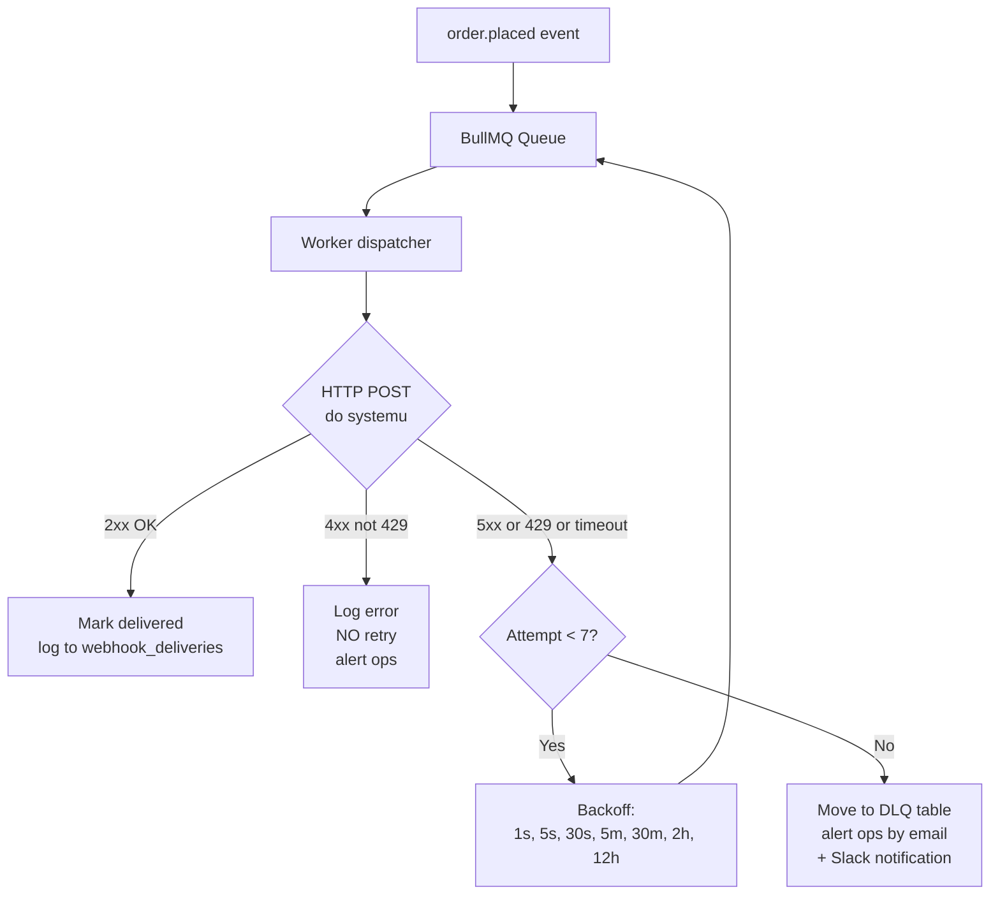

**Tabela `webhook_dead_letters`:**
- id
- event_id
- destination (production/logistics/billing)
- payload_json
- last_error
- attempts
- created_at
- resolved_at (NULL gdy nie naprawione)
- resolved_by_user_id

Admin może w UI manualnie:
- Zobaczyć DLQ
- Edytować payload (np. naprawić zły adres)
- Re-fire webhook
- Mark as resolved (np. obsługa ręczna)

### 10.7 Bezpieczeństwo

**HMAC signature:**
```typescript
const signature = crypto
  .createHmac('sha256', WEBHOOK_SECRET_PRODUCTION)
  .update(JSON.stringify(payload))
  .digest('hex')

// W header:
headers['X-Webhook-Signature'] = `sha256=${signature}`
```

Odbiorca weryfikuje signature przed parsowaniem payload.

**Secret rotation:** support dla 2 sekretów jednocześnie (current + previous, np. tydzień overlap dla rotacji bez downtime).

**Allowed IPs:** opcjonalnie whitelist IP po stronie odbiorcy (jeśli systemy w sieci VPN).

---

## 11. Schema bazy danych (tylko sklep)

```sql
CREATE EXTENSION IF NOT EXISTS postgis;

-- ============================================
-- Strefy dostawy
-- ============================================
CREATE TYPE zone_type_enum AS ENUM ('local', 'regional', 'national');
CREATE TYPE delivery_method_enum AS ENUM ('own_fleet', 'courier_dpd', 'courier_inpost', 'pickup_only');

CREATE TABLE delivery_zones (
  id              text PRIMARY KEY DEFAULT 'dz_' || gen_random_uuid()::text,
  name            varchar(120) NOT NULL,
  slug            varchar(120) UNIQUE NOT NULL,
  zone_type       zone_type_enum NOT NULL,
  delivery_method delivery_method_enum NOT NULL,
  polygon         geometry(MultiPolygon, 4326) NOT NULL,
  base_delivery_fee_cents int NOT NULL DEFAULT 0,
  free_delivery_threshold_cents int NULL,
  min_order_cents int NOT NULL DEFAULT 0,
  lead_time_days  int NOT NULL DEFAULT 0,
  cutoff_hour     int NOT NULL DEFAULT 18,
  cutoff_minute   int NOT NULL DEFAULT 0,
  allowed_product_categories text[] NOT NULL DEFAULT ARRAY['catering_boxes'],
  max_transport_hours int NULL,
  priority        int NOT NULL DEFAULT 100,
  is_active       boolean NOT NULL DEFAULT true,
  display_color   varchar(7) DEFAULT '#C9A961',
  created_at      timestamptz NOT NULL DEFAULT now(),
  updated_at      timestamptz NOT NULL DEFAULT now(),
  deleted_at      timestamptz NULL
);

CREATE INDEX idx_delivery_zones_polygon ON delivery_zones USING GIST (polygon);
CREATE INDEX idx_delivery_zones_active ON delivery_zones (is_active) WHERE deleted_at IS NULL;

-- ============================================
-- Okienka czasowe
-- ============================================
CREATE TYPE slot_status_enum AS ENUM ('open', 'full', 'blocked', 'closed');

CREATE TABLE delivery_time_slots (
  id                text PRIMARY KEY DEFAULT 'ts_' || gen_random_uuid()::text,
  delivery_zone_id  text NOT NULL REFERENCES delivery_zones(id) ON DELETE CASCADE,
  slot_date         date NOT NULL,
  time_from         time NOT NULL,
  time_to           time NOT NULL,
  capacity          int NOT NULL,
  booked_count      int NOT NULL DEFAULT 0,
  status            slot_status_enum NOT NULL DEFAULT 'open',
  admin_note        text NULL,
  created_at        timestamptz NOT NULL DEFAULT now(),
  updated_at        timestamptz NOT NULL DEFAULT now(),
  CONSTRAINT slot_capacity_positive CHECK (capacity >= 0),
  CONSTRAINT slot_booked_lte_capacity CHECK (booked_count <= capacity),
  CONSTRAINT slot_time_order CHECK (time_to > time_from),
  CONSTRAINT slot_unique UNIQUE (delivery_zone_id, slot_date, time_from)
);

CREATE INDEX idx_slots_zone_date ON delivery_time_slots (delivery_zone_id, slot_date);

CREATE TYPE reservation_status_enum AS ENUM ('pending', 'confirmed', 'expired', 'released');

CREATE TABLE slot_reservations (
  id              text PRIMARY KEY DEFAULT 'rs_' || gen_random_uuid()::text,
  time_slot_id    text NOT NULL REFERENCES delivery_time_slots(id) ON DELETE CASCADE,
  cart_id         text NOT NULL,
  order_id        text NULL,
  status          reservation_status_enum NOT NULL DEFAULT 'pending',
  reserved_at     timestamptz NOT NULL DEFAULT now(),
  expires_at      timestamptz NOT NULL,
  confirmed_at    timestamptz NULL,
  released_at     timestamptz NULL,
  CONSTRAINT res_unique_per_cart UNIQUE (cart_id, time_slot_id)
);

CREATE INDEX idx_reservations_expires ON slot_reservations (expires_at) WHERE status = 'pending';

-- ============================================
-- Produkty: atrybuty cateringowe + dostępność per strefa
-- ============================================
CREATE TYPE catering_category_enum AS ENUM ('hot_meals', 'catering_boxes', 'diet_meals', 'bundles', 'event_special', 'subscription');
CREATE TYPE packaging_type_enum AS ENUM ('thermal', 'wooden_box', 'diet_container', 'cake_box', 'mixed');
CREATE TYPE temperature_enum AS ENUM ('hot', 'cold', 'room_temp', 'frozen');

CREATE TABLE product_catering_attributes (
  product_id              text PRIMARY KEY,
  category                catering_category_enum NOT NULL,
  production_lead_time_days int NOT NULL DEFAULT 1,
  cutoff_override_hour    int NULL,
  packaging_type          packaging_type_enum NOT NULL,
  shelf_life_hours        int NOT NULL DEFAULT 48,
  temperature_constraint  temperature_enum NOT NULL DEFAULT 'room_temp',
  transport_max_hours     int NULL,
  portions_default        int NOT NULL DEFAULT 10,
  portions_min            int NOT NULL DEFAULT 1,
  portions_max            int NULL,
  diet_tags               text[] NOT NULL DEFAULT '{}',
  allergens               text[] NOT NULL DEFAULT '{}',
  can_be_subscribed       boolean NOT NULL DEFAULT false,
  created_at              timestamptz NOT NULL DEFAULT now(),
  updated_at              timestamptz NOT NULL DEFAULT now()
);

CREATE TABLE product_zone_availability (
  product_id              text NOT NULL,
  delivery_zone_id        text NOT NULL REFERENCES delivery_zones(id) ON DELETE CASCADE,
  is_available            boolean NOT NULL DEFAULT true,
  custom_lead_time_days   int NULL,
  price_override_cents    int NULL,
  PRIMARY KEY (product_id, delivery_zone_id)
);

CREATE INDEX idx_pza_zone ON product_zone_availability (delivery_zone_id) WHERE is_available = true;

-- ============================================
-- Zamówienia: metadata cateringowa (1:1 z Medusa Order)
-- ============================================
CREATE TABLE order_catering_metadata (
  order_id              text PRIMARY KEY,
  delivery_zone_id      text NOT NULL REFERENCES delivery_zones(id),
  time_slot_id          text NOT NULL REFERENCES delivery_time_slots(id),
  delivery_address_lat  decimal(10, 7) NOT NULL,
  delivery_address_lng  decimal(10, 7) NOT NULL,
  delivery_instructions text NULL,
  requires_invoice      boolean NOT NULL DEFAULT false,
  invoice_nip           varchar(20) NULL,
  invoice_company_name  varchar(200) NULL,
  source                varchar(50) NOT NULL DEFAULT 'storefront',
  ai_brief              text NULL,
  referral_code         varchar(40) NULL,
  production_status     varchar(50) NULL,
  delivery_status       varchar(50) NULL,
  courier_tracking_number varchar(100) NULL,
  created_at            timestamptz NOT NULL DEFAULT now(),
  updated_at            timestamptz NOT NULL DEFAULT now()
);

-- ============================================
-- Subskrypcje
-- ============================================
CREATE TYPE sub_frequency_enum AS ENUM ('weekly', 'bi_weekly', 'monthly');
CREATE TYPE sub_status_enum AS ENUM ('active', 'paused', 'canceled', 'past_due');

CREATE TABLE subscriptions (
  id                    text PRIMARY KEY DEFAULT 'sub_' || gen_random_uuid()::text,
  customer_id           text NOT NULL,
  name                  varchar(200) NOT NULL,
  product_set           jsonb NOT NULL,
  rotation_pool         jsonb NULL,
  excluded_products     text[] NOT NULL DEFAULT '{}',
  frequency             sub_frequency_enum NOT NULL,
  delivery_day_of_week  int NULL CHECK (delivery_day_of_week BETWEEN 1 AND 7),
  delivery_zone_id      text NOT NULL REFERENCES delivery_zones(id),
  preferred_slot_time   time NULL,
  delivery_address      jsonb NOT NULL,
  stripe_subscription_id varchar(100) NULL,
  stripe_customer_id     varchar(100) NULL,
  status                sub_status_enum NOT NULL DEFAULT 'active',
  start_date            date NOT NULL,
  next_delivery_date    date NOT NULL,
  paused_until          date NULL,
  canceled_at           timestamptz NULL,
  cycle_price_cents     int NOT NULL,
  total_paid_cents      int NOT NULL DEFAULT 0,
  total_deliveries      int NOT NULL DEFAULT 0,
  created_at            timestamptz NOT NULL DEFAULT now(),
  updated_at            timestamptz NOT NULL DEFAULT now()
);

CREATE INDEX idx_sub_customer ON subscriptions (customer_id);
CREATE INDEX idx_sub_next_delivery ON subscriptions (next_delivery_date) WHERE status = 'active';

-- Każda dostawa subskrypcji jest osobnym Medusa Order, ale linkujemy:
ALTER TABLE order_catering_metadata
  ADD COLUMN subscription_id text NULL REFERENCES subscriptions(id);

-- ============================================
-- Loyalty
-- ============================================
CREATE TYPE loyalty_tier_enum AS ENUM ('bronze', 'silver', 'gold', 'platinum');

CREATE TABLE customer_loyalty_state (
  customer_id              text PRIMARY KEY,
  current_tier             loyalty_tier_enum NOT NULL DEFAULT 'bronze',
  lifetime_orders_count    int NOT NULL DEFAULT 0,
  lifetime_spent_cents     bigint NOT NULL DEFAULT 0,
  rolling_12m_orders_count int NOT NULL DEFAULT 0,
  rolling_12m_spent_cents  bigint NOT NULL DEFAULT 0,
  points_balance           int NOT NULL DEFAULT 0,
  tier_attained_at         timestamptz NULL,
  last_recalculated_at     timestamptz NULL,
  created_at               timestamptz NOT NULL DEFAULT now(),
  updated_at               timestamptz NOT NULL DEFAULT now()
);

-- ============================================
-- Referral
-- ============================================
CREATE TABLE referral_codes (
  code                  varchar(40) PRIMARY KEY,
  referrer_customer_id  text NOT NULL,
  is_active             boolean NOT NULL DEFAULT true,
  total_referrals       int NOT NULL DEFAULT 0,
  total_payouts_cents   bigint NOT NULL DEFAULT 0,
  created_at            timestamptz NOT NULL DEFAULT now()
);

CREATE INDEX idx_referral_referrer ON referral_codes (referrer_customer_id);

CREATE TYPE referral_status_enum AS ENUM ('pending', 'paid', 'refunded');

CREATE TABLE referral_redemptions (
  id                              text PRIMARY KEY DEFAULT 'rfr_' || gen_random_uuid()::text,
  code                            varchar(40) NOT NULL REFERENCES referral_codes(code),
  referred_customer_id            text NOT NULL,
  order_id                        text NOT NULL,
  referrer_credit_amount_cents    int NOT NULL,
  referred_discount_amount_cents  int NOT NULL,
  status                          referral_status_enum NOT NULL DEFAULT 'pending',
  created_at                      timestamptz NOT NULL DEFAULT now()
);

-- ============================================
-- Customer preferences
-- ============================================
CREATE TABLE customer_preferences (
  customer_id           text PRIMARY KEY,
  diet                  text[] NOT NULL DEFAULT '{}',
  allergens_avoid       text[] NOT NULL DEFAULT '{}',
  dislikes              text[] NOT NULL DEFAULT '{}',
  favorite_cuisines     text[] NOT NULL DEFAULT '{}',
  default_portions      int NULL,
  default_zone_id       text NULL REFERENCES delivery_zones(id),
  marketing_consent     boolean NOT NULL DEFAULT false,
  updated_at            timestamptz NOT NULL DEFAULT now()
);

CREATE TABLE customer_favorites (
  customer_id   text NOT NULL,
  product_id    text NOT NULL,
  added_at      timestamptz NOT NULL DEFAULT now(),
  PRIMARY KEY (customer_id, product_id)
);

-- ============================================
-- Webhook dispatch + DLQ
-- ============================================
CREATE TYPE webhook_status_enum AS ENUM ('queued', 'delivered', 'failed_retry', 'dead_letter');

CREATE TABLE webhook_deliveries (
  id              text PRIMARY KEY DEFAULT 'wh_' || gen_random_uuid()::text,
  event_id        text NOT NULL UNIQUE,
  destination     varchar(50) NOT NULL,
  event_type      varchar(80) NOT NULL,
  endpoint_url    text NOT NULL,
  payload_json    jsonb NOT NULL,
  status          webhook_status_enum NOT NULL DEFAULT 'queued',
  attempts        int NOT NULL DEFAULT 0,
  last_attempt_at timestamptz NULL,
  delivered_at    timestamptz NULL,
  last_status_code int NULL,
  last_error      text NULL,
  next_retry_at   timestamptz NULL,
  created_at      timestamptz NOT NULL DEFAULT now()
);

CREATE INDEX idx_wh_status ON webhook_deliveries (status);
CREATE INDEX idx_wh_next_retry ON webhook_deliveries (next_retry_at) WHERE status = 'failed_retry';
CREATE INDEX idx_wh_event ON webhook_deliveries (event_id);

CREATE TABLE webhook_dead_letters (
  id              text PRIMARY KEY DEFAULT 'wdl_' || gen_random_uuid()::text,
  webhook_delivery_id text NOT NULL REFERENCES webhook_deliveries(id),
  destination     varchar(50) NOT NULL,
  payload_json    jsonb NOT NULL,
  last_error      text NULL,
  attempts        int NOT NULL,
  resolved_at     timestamptz NULL,
  resolved_by_user_id text NULL,
  created_at      timestamptz NOT NULL DEFAULT now()
);

-- ============================================
-- Webhooks IN: idempotency tracking
-- ============================================
CREATE TABLE incoming_webhook_log (
  event_id        text PRIMARY KEY,
  source          varchar(50) NOT NULL,  -- 'production' / 'logistics'
  event_type      varchar(80) NOT NULL,
  payload_json    jsonb NOT NULL,
  received_at     timestamptz NOT NULL DEFAULT now(),
  processed_at    timestamptz NULL,
  result          varchar(20) NULL  -- 'success', 'duplicate', 'error'
);
```

**Tabele nie dotykane (Medusa core używamy bez zmian):**
- `cart`, `cart_line_item`
- `order`, `order_item`
- `customer`
- `product`, `product_variant`, `product_option`
- `region`, `currency`
- `promotion`, `promotion_rule`
- `payment`, `payment_session`, `stripe_*`

---

## 12. Mermaid diagramy przepływów

### 12.1 Klient: pełny flow zakupu

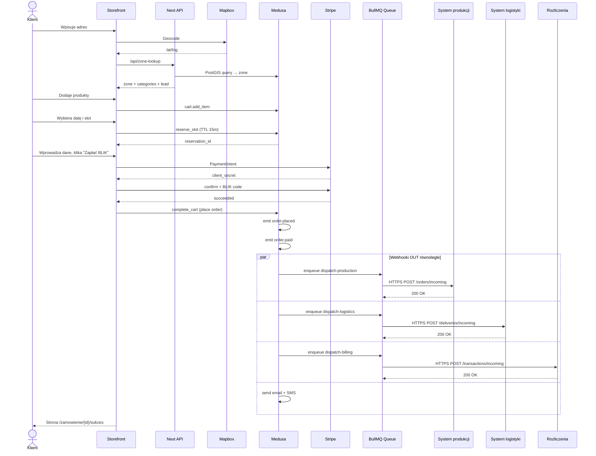

### 12.2 Webhook retry flow

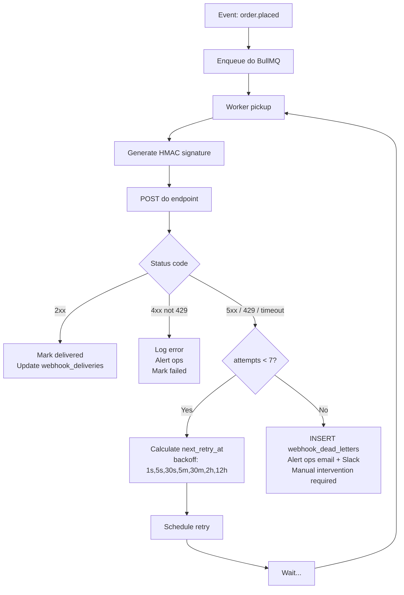

### 12.3 Subskrypcja: cron generation

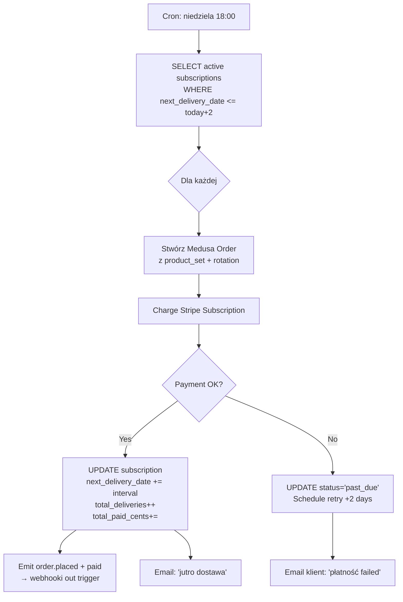

---

## 13. Harmonogram (3 sprinty, ~10 tygodni)

### Sprint 1 — Fundament + sklep B2C (4 tygodnie)

**Cel:** klient może kupić BOX z BLIKiem, w wybranej strefie, w wybranym okienku.

| Task | Czas | Owner |
|---|---|---|
| Setup monorepo + Medusa 2.0 + PostgreSQL/PostGIS + Redis | 2d | DevOps |
| Custom module `delivery-zones` (model + service) | 2d | Backend |
| Custom module `time-slots` (model + cron) | 2d | Backend |
| Custom module `catering-attributes` + `product-zone-availability` | 1d | Backend |
| Import 200 produktów z CSV | 1d | Backend |
| Address-to-zone API endpoint | 1d | Backend |
| Storefront: landing page (z mockup `01-landing.html`) | 3d | Frontend |
| Storefront: katalog z filtrami | 3d | Frontend |
| Storefront: karta produktu | 2d | Frontend |
| Storefront: koszyk drawer | 2d | Frontend |
| Stripe plugin + BLIK setup w Stripe Dashboard PL | 1d | Backend |
| Storefront: checkout 5-stepowy | 4d | Frontend |
| Slot reservation workflow (pessimistic locking + TTL cron) | 2d | Backend |
| Medusa Admin extensions: zone editor + slot manager | 3d | Frontend |
| Email templates (Resend + React Email) | 2d | Frontend |
| SMS notifications (SMSAPI) | 1d | Backend |
| QA + E2E test | 3d | QA |
| Deploy staging | 1d | DevOps |

**Deliverable:** sklep B2C live na staging, klient może zamówić.

### Sprint 2 — Webhooks OUT + konto klienta (3 tygodnie)

**Cel:** zamówienie trafia do 3 systemów. Klient ma konto z historią.

| Task | Czas | Owner |
|---|---|---|
| BullMQ setup + Redis queues | 1d | Backend |
| Webhook dispatcher service (HMAC, retry, DLQ) | 2d | Backend |
| Subscriber `order.placed` → dispatch-production | 1d | Backend |
| Subscriber `order.paid` → dispatch-logistics | 1d | Backend |
| Subscriber `order.paid` → dispatch-billing | 1d | Backend |
| Webhook IN endpoints (idempotency + signature verify) | 2d | Backend |
| Admin: DLQ viewer + manual re-fire | 2d | Frontend |
| Konto klienta: dashboard | 2d | Frontend |
| Konto: historia zamówień + reorder | 2d | Frontend |
| Konto: szczegóły zamówienia z tracking | 2d | Frontend |
| Konto: ulubione produkty | 1d | Frontend |
| Konto: preferencje dietetyczne | 1d | Frontend |
| Magic link auth (Medusa Customer) | 1d | Backend |
| Mock systemów docelowych (do testów end-to-end) | 1d | Backend |
| E2E test: zamówienie → 3 webhooki → confirmed | 2d | QA |

**Deliverable:** integracja z istniejącymi systemami działa end-to-end. Klient ma konto.

### Sprint 3 — Subskrypcje, promocje, AI, polish (3 tygodnie)

**Cel:** flagowa różnicowość — subskrypcje, loyalty, AI Generator.

| Task | Czas | Owner |
|---|---|---|
| Custom module `subscriptions` (model + service) | 2d | Backend |
| Stripe Subscriptions wiring | 2d | Backend |
| Cron: weekly subscription order generation | 1d | Backend |
| Storefront: page "Subskrypcja lunch dla biura" | 2d | Frontend |
| Konto: zarządzanie subskrypcjami (pause/modify/cancel) | 2d | Frontend |
| Loyalty engine + rolling 12m calculation cron | 2d | Backend |
| Referral codes + redemption flow | 2d | Backend |
| Storefront: konfigurator B2B (z mockup `02-konfigurator-b2b.html`) | 3d | Frontend |
| Anthropic Claude API integration + system prompt | 1d | Backend |
| `/api/ai/generate-menu` endpoint | 1d | Backend |
| AI proposal → Medusa cart workflow | 1d | Backend |
| PDF generator ofert B2B (React-PDF) | 2d | Backend |
| Sanity setup + 5 starting blog posts | 3d | Frontend + Marketing |
| Schema.org markup + sitemap + meta tags | 1d | Frontend |
| Performance audit (Lighthouse 95+) | 1d | DevOps |
| QA full regression | 2d | QA |
| Migracja produkcyjna (DNS, dane, redirecty 301) | 1d | DevOps |

**Deliverable:** pełna produkcja, AI Generator live, subskrypcje aktywne, loyalty + referral wdrożone.

### Sumarycznie

**~10 tygodni = 2.5 miesiąca** developmentu z zespołem 1 backend + 1 frontend + DevOps part-time.

Z sesją zdjęciową + buforem: **~3 miesiące do pełnej produkcji**.

---

## 14. Risk register

### Top 10 ryzyk

| # | Ryzyko | Praw. | Wpływ | Mitygacja |
|---|---|---|---|---|
| 1 | **Webhook OUT do istniejących systemów fails** (np. system produkcji down) | Średnie | Wysoki | Retry z backoff (7 prób), DLQ, alert ops, fallback manual processing |
| 2 | **Race condition na slot** — 2 klientów rezerwuje ostatni | Średnie | Średni | SELECT FOR UPDATE + TTL + cleanup cron (rozdz. 6.3) |
| 3 | **Webhook payload schema mismatch** z istniejącym systemem | Wysokie (na start) | Wysoki | Kontrakt API uzgodniony pisemnie z ops team przed dev, mock server podczas budowy |
| 4 | **PostGIS slow przy >10k adresach** | Niskie | Średni | GIST index, denormalizacja `customer.default_zone_id`, Redis cache geocoding |
| 5 | **Stripe BLIK quirks** (kod ważny 60s, dziwne błędy) | Średnie | Średni | Dobry UX (countdown), fallback Przelewy24, retry mechanism |
| 6 | **Medusa 2.x breaking changes podczas dev** | Średnie | Wysoki | Lock major version, monitor changelog, manual upgrade z testami |
| 7 | **AI Generator halucynuje produkty** | Średnie | Średni | Strict JSON schema validation, lookup produktów po ID, fallback "skontaktuj sprzedawcę" |
| 8 | **Brak prawdziwych zdjęć produktów** | Niskie (jeśli planujemy sesję) | Krytyczny | Sesja zdjęciowa 50 BOXów = blocker dla launch — sprint przed Sprintem 1 |
| 9 | **Sezonowość ruchu** (Sylwester, komunie) | Wysokie | Średni | Auto-scale Vercel + Railway, load testing pre-sezon, capacity limit per slot |
| 10 | **GDPR/RODO leakage przy webhook OUT** | Niskie | Krytyczny | HMAC + HTTPS + VPN (jeśli wewnętrzne) + minimalizacja payload (tylko niezbędne PII) |

### Ryzyka organizacyjne

- **Ops team nie ma czasu na integrację** — należy uzgodnić timeline z nimi WCZEŚNIEJ
- **Konflikt: kto jest source of truth** dla statusu zamówienia (nasz sklep czy ich systemy?) — decyzja: **status finansowy = nasz**, **status produkcji/dostawy = ich**
- **Brak monitoringu po stronie ich systemów** — jeśli oni zgubią webhook, my musimy mieć alerty (przez webhook_deliveries.last_status_code)

### Co NIE jest już ryzykiem (vs v2)

Wcześniej v2 miała ryzyka: route optimization, KDS scaling, driver app, courier API niestabilne. Po cięciu scope **te ryzyka są poza naszym scope** — należą do ops team i ich systemów.

---

## 15. Appendix — webhook contracts (OpenAPI-style)

### 15.1 Production webhook

```yaml
openapi: 3.0.3
info:
  title: Catering Śląski → System Produkcji webhook
  version: 1.0.0

paths:
  /api/v1/orders/incoming:
    post:
      summary: Nowe zamówienie do produkcji
      security:
        - HMAC-Signature: []
      parameters:
        - name: X-Webhook-Signature
          in: header
          required: true
          schema: { type: string }
          description: HMAC-SHA256(payload, shared_secret)
        - name: X-Idempotency-Key
          in: header
          required: true
          schema: { type: string }
          description: order.id — system odbiorcy musi obsłużyć duplicate
        - name: X-Webhook-Version
          in: header
          required: true
          schema: { type: string, enum: ["1"] }
      requestBody:
        required: true
        content:
          application/json:
            schema:
              $ref: '#/components/schemas/OrderPlacedPayload'
      responses:
        '200':
          description: OK — produkcja przyjęła zamówienie
          content:
            application/json:
              schema:
                type: object
                properties:
                  received: { type: boolean }
                  event_id: { type: string }
                  production_id: { type: string }
        '400':
          description: Bad payload — nie retry
        '401':
          description: Bad signature — nie retry
        '409':
          description: Duplicate (idempotency hit) — OK, nie retry
        '500':
          description: Server error — retry z backoff

components:
  schemas:
    OrderPlacedPayload:
      type: object
      required: [event_id, event_type, event_timestamp, webhook_version, order, delivery, items]
      properties:
        event_id: { type: string }
        event_type: { type: string, enum: [order.placed, order.paid] }
        event_timestamp: { type: string, format: date-time }
        webhook_version: { type: string }
        order:
          $ref: '#/components/schemas/OrderRef'
        delivery:
          $ref: '#/components/schemas/DeliveryInfo'
        items:
          type: array
          items: { $ref: '#/components/schemas/ItemDetail' }
        customer_preferences:
          $ref: '#/components/schemas/CustomerPreferences'
        total_portions_estimated: { type: integer }
        preparation_deadline: { type: string, format: date-time }
```

(Pełne schemas w /docs/openapi-webhooks.yaml — do uzupełnienia po uzgodnieniach z ops)

### 15.2 Logistics webhook

```yaml
paths:
  /api/v1/deliveries/incoming:
    post:
      summary: Nowa dostawa do logistyki
      # similar structure to production
```

### 15.3 Billing webhook

```yaml
paths:
  /api/v1/transactions/incoming:
    post:
      summary: Nowa transakcja do księgowania
      # similar structure
```

### 15.4 Webhook IN (od istniejących systemów do nas)

```yaml
paths:
  /api/webhooks/incoming/production:
    post:
      summary: Status produkcji aktualizowany przez system produkcji
      security: [{ HMAC-Signature: [] }]
      requestBody:
        content:
          application/json:
            schema:
              type: object
              required: [event_id, event_type, order_id, status]
              properties:
                event_id: { type: string }
                event_type: { type: string, enum: [production.status_changed] }
                order_id: { type: string }
                status: { type: string, enum: [started, ready, packed] }
                timestamp: { type: string, format: date-time }
                production_id: { type: string }

  /api/webhooks/incoming/logistics:
    post:
      summary: Status dostawy aktualizowany przez system logistyki
      # similar
```

---

## Podsumowanie zmian vs v2

| Element | v2 | v3 |
|---|---|---|
| Scope | Pełna platforma (sklep + produkcja + logistyka + faktury) | **Tylko sklep + webhooki** |
| Czas dostarczania | 16-17 tyg | **~10 tyg** |
| Custom modules Medusa | 8 | **5** (delivery-zones, time-slots, catering-attributes, subscriptions, promotions ext.) |
| Tabele DB | ~20 | **~15** (usunięte: drivers, routes, route_stops, pickup_points) |
| Diagramy Mermaid | 4 | **3** (skupione na sklep + webhooki) |
| Risk register | 10 ryzyk + biz | **10 + organizacyjne** (głównie integracyjne) |
| KDS/route planner | Custom build | **Wycięte** (istnieje) |
| Fakturownia direct | Custom subscriber | **Wycięte** (webhook do rozliczeń) |
| AI Generator | Tak | **Tak (zostaje)** |
| Subskrypcje | Tak | **Tak (rozszerzone — rotacja menu)** |
| Promocje | Wzmianka | **Rozdział pełny — kody + loyalty + referral** |

---

## Następne kroki

1. **Spotkanie z ops team** — uzgodnienie kontraktów webhook (payload structure, endpointy, secrets exchange)
2. **Akceptacja dokumentu** przez właściciela i tech lead
3. **Sesja zdjęciowa 50 BOXów** — równolegle, priorytet
4. **Sprint 1 kick-off** — od Medusa setup
5. **Mock server** dla 3 istniejących systemów (do testów podczas dev) — odpowiedzialność ops team lub nasza tymczasowo

---

*Wersja 3.0 — sklep zamówieniowy z integracją do istniejących systemów. Catering Śląski redesign, 19 maja 2026.*
